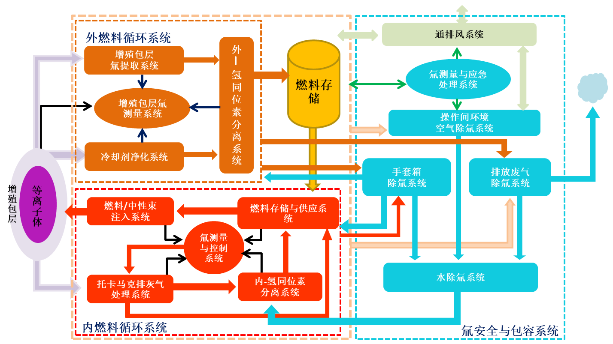

# TRICYS - Tritium Integrated Cycle Simulation Platform

[](./LICENSE)
[](https://www.python.org/downloads/)
[](https://asipp-neutronics.github.io/tricys/)

**TRICYS** (**TR**itium **I**ntegrated **CY**cle **S**imulation) is an open-source, modular, multi-scale fusion reactor tritium fuel cycle simulator, designed to provide physics-based dynamic closed-loop analysis, strictly adhering to plant-wide mass conservation principles.

Our goal is to provide researchers and engineers with a flexible and robust platform to explore various tritium management strategies, optimize system designs, and gain deep insights into tritium flow and inventory dynamics in fusion reactor environments.



## Features

- **Parameter Scanning & Concurrency**: Systematically investigate the impact of multiple parameters on system performance, supporting concurrent execution and large-scale batch simulations.
- **Sub-module Co-simulation**: Supports data exchange with external tools (such as Aspen Plus) to achieve sub-module system integration.
- **Automated Report Generation**: Automatically generates standardized Markdown analysis reports, including charts, statistics, and visualization results.
- **Advanced Sensitivity Analysis**: Supports custom sensitivity analysis of system parameters, integrating the SALib library to quantify the impact of parameters on outputs.
- **AI-Enhanced Analysis**: Integrates Large Language Models (LLM) to automatically transform raw charts and data into structured academic-style reports.

In this document, `TRICYS` is used in two common senses: in the narrow sense, it refers to the `tricys` core simulation engine; in the broad sense, it refers to the full TRICYS platform composed of `tricys`, `tricys_backend`, `tricys_visual`, and `tricys_goview`.

## What Is the TRICYS Core?

In the narrow sense, TRICYS refers specifically to the `tricys` core simulation engine. It is responsible for physics modeling, Modelica integration, parameter scanning, sensitivity analysis, and report generation for fusion reactor tritium fuel cycle studies. If your goal is to run models, analyze outputs, reproduce examples, or perform local algorithm research, you usually only need to deploy the TRICYS core first.

Its core capabilities include:
- Running Modelica-driven tritium cycle simulations.
- Executing parameter scans, concurrent computations, and sensitivity analysis.
- Generating reports, figures, and structured analysis results.
- Serving as the computational and data foundation for backend services, frontend applications, and dashboard views.

## What Is the TRICYS Platform?

In the broad sense, TRICYS refers to the full TRICYS platform rather than only a Python package. It is a coordinated system made up of the core simulation engine, backend services, and frontend applications:

- **`tricys` (Core)**: The core Python engine handling physics modeling, Modelica integration, parameter scanning, and AI-enhanced report generation.
- **`tricys_backend`**: A high-performance FastAPI service that manages simulation task queues, WebSocket log streaming, and HDF5 data retrieval.
- **`tricys_visual`**: The modern Vue 3 frontend for real-time 3D visualization, system configuration, and monitoring.
- **`tricys_goview`**: A specialized low-code data dashboard built on the Vue 3 GoView framework for advanced analytical visualizations.

Different goals map to different startup paths:
- If you only want to run models, examples, and analysis workflows, deploy the `tricys` core.
- If you want the full experience, including backend APIs, the main frontend, and the GoView dashboard, deploy the full platform.

## Quick Start the TRICYS Core

To ensure full compatibility with co-simulation features involving external Windows software such as Aspen Plus, Windows local installation remains the recommended path for the core simulation workflow.

### 1. Requirements
1. **Python**: Recommended Python 3.10+, minimum supported Python 3.8.
2. **Git**: Recommended Git 2.40+ for cloning the repository and syncing submodules.
3. **OpenModelica**: Recommended OpenModelica 1.24+, with `omc.exe` available in `PATH`.

### 2. Deployment Steps

1. **Clone the repository**
   ```shell
   git clone https://github.com/asipp-neutronics/tricys.git
   cd tricys
   ```

2. **Run the deployment wizard**
   The repository provides a unified deployment entrypoint that checks the current environment, recommends versions for missing dependencies, and lets you choose the deployment mode.
   ```shell
   Makefile.bat
   ```
   Or run it explicitly:
   ```shell
   Makefile.bat deploy
   ```

3. **Choose `core-local` mode**
   This mode will:
   - Install the local Python core environment.
   - Register OpenModelica.
   - Install `tricys` in editable mode.

### 3. Run an Example

After installation, you can launch the interactive example runner to quickly try the TRICYS core:

```shell
tricys example
```

This command scans and lists all available basic and advanced analysis examples. You only need to enter the number as prompted to run the corresponding example task.

## Quick Deploy the TRICYS Platform

If you want to run the complete project ecosystem locally, including the backend engine, the HDF5 visualization service, and both frontend applications, use the repository's deployment wizard or lifecycle commands.

### 1. Use the Deployment Wizard

```bash
# Windows default entrypoint
Makefile.bat

# Windows explicit entrypoint
Makefile.bat deploy

# Linux default entrypoint
make

# Linux explicit entrypoint
make deploy
```

The deployment wizard supports three modes:
- `core-local`: install the local Python core and register OpenModelica.
- `fullstack-local`: start the local backend, hdf5, visual, and goview development stack.
- `docker-fullstack`: start the full containerized stack with Docker Compose.

If you want the full platform, the usual choices are:
- Windows or local development environment: `fullstack-local`
- Containerized deployment or standard 0D scenarios: `docker-fullstack`

### 2. Use Lifecycle Commands

If you prefer to skip the interactive wizard, you can use the managed lifecycle commands directly:

```bash
# Install local full-stack dependencies
Makefile.bat app-install

# Start backend, hdf5, visual frontend, and goview dashboard
Makefile.bat app-start

# Stop the local full stack
Makefile.bat app-stop
```

These commands wrap the existing scripts under `script/dev/windows/` or `script/dev/linux/`, align with the rest of the repository lifecycle commands, and now include improvements such as pre-deployment state detection and stop-before-clean behavior.

### 3. Docker Alternative

If you do not require co-simulation with external Windows software and want a simpler environment, you can use the currently maintained Docker images instead:

1. `ghcr.io/asipp-neutronics/tricys:latest`
    This is the full platform image, covering backend, visual, goview, and hdf5 entrypoints, and corresponds to `docker-compose.yml`.
2. `ghcr.io/asipp-neutronics/tricys-hdf5:latest`
    This is the HDF5-only image, corresponding to `docker-compose.hdf5.yml`, and is suitable for HDF5 visualization or lightweight development scenarios.

If you want to start them directly with Compose:

```bash
# Full platform
docker compose up -d --build

# HDF5-only service
docker compose -f docker-compose.hdf5.yml up -d --build
```

If you use VSCode Dev Containers:

1. Clone the repository and open it in VSCode.
2. Reopen it in the container when prompted.
3. After the container starts, run:
    ```bash
    make dev-install
    ```

## Interactive Deployment Wizard Details

If you want a single entrypoint for environment checks, deployment mode selection, and startup orchestration, you can also run the native scripts directly:

```bash
# Windows
script\dev\windows\deploy.bat

# Linux
bash ./script/dev/linux/deploy.sh
```

The deployment wizard will:
- Check key dependencies including Python, Git, Node.js, npm, Docker, Compose, and OpenModelica.
- Recommend versions when required dependencies are missing.
- Detect whether a local full stack or Docker stack is already running.
- When a local fullstack deployment is already running, prompt you to skip, restart, or continue.

## Documentation

For more detailed feature introductions, configuration guides, and advanced tutorials, please visit our [Online Documentation](https://asipp-neutronics.github.io/tricys/en/).

## Contribution

We welcome any contributions from the community! If you wish to participate in the development of `tricys`, please follow these guidelines:

- **Code Style**: Use `black` for code formatting, `ruff` for style checking and fixing.
- **Naming Conventions**: Follow `snake_case` (variables/functions) and `PascalCase` (classes) conventions.
- **Docstrings**: All public modules, classes, and functions must include Google-style docstrings.
- **Testing**: Use `pytest` to write unit tests and ensure high coverage.
- **Git Commits**: Follow [Conventional Commits](https://www.conventionalcommits.org/) specification to keep commit history clear and readable.

## License

This project is licensed under the [Apache-2.0](./LICENSE) License.
