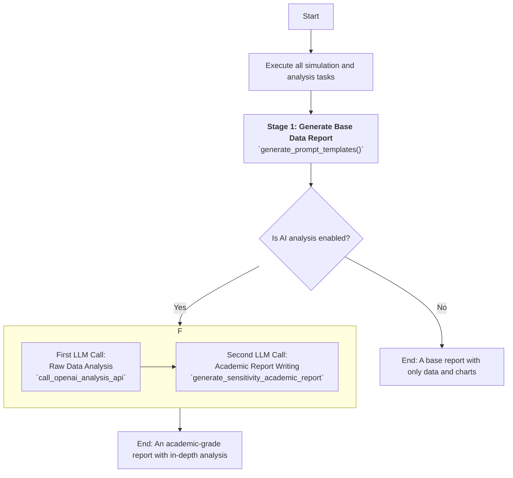

# TRICYS Automated Analysis Reports

TRICYS is more than just a simulation execution framework; it is also a powerful platform for automated analysis and reporting. It can automatically process complex simulation results into well-structured, content-rich analysis reports that support both English and Chinese. Its report generation process uses an innovative layered design, achieving end-to-end automation from data-driven chart generation to optional, Large Language Model (LLM)-driven in-depth analysis and academic-grade report writing.


## 1. Glossary and Internationalized Charts

To make the generated charts professional and readable, TRICYS introduces a label mapping mechanism based on an external glossary, which also supports switching between English and Chinese.

### 1.1 How It Works

This functionality is implemented by the `tricys/analysis/plot.py` module.

1.  **Load Glossary**: When the program starts, the `load_glossary()` function reads a user-specified CSV file (`glossary_path`). This CSV file defines the correspondence between internal model variable names and their professional terms in English and Chinese.
2.  **Set Language**: By calling `set_plot_language('cn')` or `set_plot_language('en')`, the display language of the charts can be switched globally. When switching to Chinese, a font that supports Chinese characters (e.g., "SimHei") is automatically enabled.
3.  **Format Labels**: When plotting, all raw variable names (e.g., `Startup_Inventory`, `sds.I[1]`) are processed by the `_format_label()` function. This function will:
    *   First, look up the corresponding professional term in English or Chinese in the loaded glossary based on the current language setting.
    *   If found, it uses that professional term as the chart label (e.g., for legends, axis titles).
    *   If not found, it performs default formatting (e.g., replacing underscores with spaces) to ensure basic readability.
4.  **Unit Mapping**: In addition to terms, the units on the axes can also be converted and displayed via the `unit_map` configuration, which also supports internationalization.

### 1.2 Glossary Format Example

The CSV file must contain the following three columns:

| Model Parameter | English Term | Chinese Translation |
| :--- | :--- | :--- |
| `Startup_Inventory` | Startup Inventory | 启动库存 |
| `Doubling_Time` | Doubling Time | 倍增时间 |
| `sds.I[1]` | Tritium Inventory in SDS | 贮存与输送系统氚库存 |

With this mechanism, TRICYS can automatically format the internal variable `Startup_Inventory` into "Startup Inventory (kg)" or "启动库存 (千克)" when generating charts.

## 2. Core Chart Types

The `generate_analysis_plots()` function in `tricys/analysis/plot.py` serves as the main entry point for all analysis charts. It generates several core types of charts based on the analysis task.

#### 2.1 Main Trend Plots

*   **Purpose**: To show how key performance indicators (dependent variables) change in response to variations in the independent sweep variable.
*   **Features**:
    *   When multiple background sweep parameters (`simulation_parameters`) are present, it automatically plots multiple curves with different colors, line styles, and markers, and generates a legend.
    *   If the number of curves is small, it automatically annotates the data points with their values for precise reading.
    *   Supports plotting multiple metrics in subplots within a single figure (`_generate_combined_plots`) or generating separate chart files for each metric (`_generate_individual_plots`).

#### 2.2 Constraint-Solving Analysis Plots

*   **Purpose**: Specifically designed to visualize the results of "goal-seeking" tasks (i.e., metrics prefixed with `Required_`).
*   **Features**:
    *   Generated by the `_generate_multi_required_plot()` function, usually in a multi-subplot layout.
    *   Each subplot represents a specific combination of background parameters, clearly showing the "cost" (the optimized parameter value) required to meet a certain constraint (e.g., doubling time less than 10 years) under different scenarios.
    *   This type of plot is crucial for understanding multi-variable trade-offs.

#### 2.3 Sweep Process Time-Series Plots

*   **Purpose**: Generated when it is necessary to observe the complete time evolution of a dynamic variable across different parameter sweeps.
*   **Features**:
    *   Generated by the `plot_sweep_time_series()` function, it contains **two subplots**:
        1.  **Overall View**: Shows the complete time curve from `t=0` to the end of the simulation. To highlight key early behaviors, this view automatically hides data points that exceed twice the initial value.
        2.  **Detailed View**: Automatically focuses on and zooms into the region where the minimum value is first reached across all curves. This is very useful for observing the system's initial dynamic characteristics (like the "dip-and-recover" turning point of the inventory).
    *   A red dashed box is automatically drawn on the "Overall View" to indicate the region corresponding to the "Detailed View".

## 3. Multi-Stage Report Generation Logic

TRICYS's report generation is divided into several core stages, orchestrated by the `tricys/analysis/report.py` module. This design separates raw data from AI interpretation, ensuring transparency and traceability of the results.



### 3.1. Stage 1: Base Data Report

This stage is executed by the `generate_prompt_templates()` function. Its core responsibility is to create a **comprehensive, purely data-driven** Markdown file. This file serves as the "source of truth" for all subsequent analysis and includes:

1.  **Configuration Details**: All configuration parameters for the analysis, such as independent/dependent variables, sweep ranges, and optimization settings.
2.  **Data Tables**: Data from `sensitivity_analysis_summary.csv` and `requierd_tbr_summary.csv` formatted into clean Markdown tables.
3.  **Embedded Charts**: All `.svg` chart files generated by `plot.py` are embedded into the report using `` syntax.
4.  **Dynamic Data Slices**: If applicable, it also extracts data slices of key dynamic processes (e.g., initial, turning point, and final stages) from `sweep_results.csv` and presents them in tabular form.

### 3.2. Stage 2: Raw Data Analysis

*   **Executor**: `call_openai_analysis_api()`
*   **Purpose**: To perform a deep, quantitative analysis of the **pure data tables** to uncover underlying trends and correlations.
*   **Process**:
    1.  The **base report** generated in Stage 1 is used as context, appended with a carefully designed analysis prompt (see next section).
    2.  A key instruction is to **ignore the charts and only analyze the tables**, which forces the model to perform quantitative rather than qualitative analysis.
    3.  The analysis result returned by the LLM is **appended** to the base report, creating a single report that contains "raw data + initial AI interpretation".

<details>
<summary>Data Analyst Prompt</summary>

```
**Role:** You are an expert in the field of tritium fuel cycles for fusion reactors.
**Task:** Please provide a deep interpretation of the sensitivity analysis results for a fusion reactor fuel cycle model, **based solely** on the **two types of data tables** provided below.
**Analysis Points (Must be answered strictly based on the data tables):**
1.  **Global Sensitivity Analysis:**
    *   What **overall trends** do the summary performance metrics tables exhibit?
    *   Which performance metric is most sensitive to changes in the independent variable `{independent_variable}`?
2.  **Interaction Effect Analysis:**
    *   Analyze the interaction effects between the independent variable and the background sweep parameters on the performance metrics.
3.  **Dynamic Process Analysis:**
    *   Observing the process data slices: what are the differences in the system's behavior during the "initial phase" and the "final phase"?
    *   What physical process does the data from the "turning point phase" reveal?
4.  **Comprehensive Conclusion:**
    *   Summarize the overall impact and potential trade-offs of adjusting `{independent_variable}` on the system.
    *   What preliminary suggestions for system design or operational optimization can be derived from these findings?
```

</details>


### 3.3. Stage 3: Academic Report Writing

*   **Executor**: `generate_sensitivity_academic_report()`
*   **Purpose**: To **"upgrade"** a mixed report containing data, charts, and preliminary analysis into a well-structured, professionally-worded academic-style report.
*   **Process**:
    1.  The **updated report** (now including the first AI analysis) and the **glossary file (`glossary.csv`)** are provided together as context.
    2.  A more complex prompt is appended, instructing the model to act as a "senior scientist" and strictly follow academic conventions.
    3.  The LLM will use the glossary to replace internal variable names with professional terms and rewrite all content according to a standard academic structure (Abstract, Introduction, Methodology, Results and Discussion, Conclusion).
    4.  The final result is saved as a new, ready-to-use academic report file (`academic_report_....md`).

<details>
<summary>Senior Scientist Prompt</summary>

```
**Role:** You are a senior scientist with a deep academic background in nuclear fusion engineering, particularly in the tritium fuel cycle.
**Task:** You have received a preliminary report and a glossary of professional terms from an automated analysis program. Based on these two documents, your task is to write a more professional, formal, and in-depth analysis summary report suitable for academic publication.
**Instructions:**
1.  **Professional Language:** Replace the model parameters/abbreviations in the preliminary report (e.g., `sds.I[1]`, `Startup_Inventory`) with their corresponding professional terms from the glossary.
2.  **Academic Rewriting:** Reorganize and rephrase the findings from the preliminary report using rigorous and objective academic language.
3.  **Presentation and Citation of Figures and Tables:**
    *   **Display Figures:** In the "Results and Discussion" section, you **must** use Markdown syntax `` to **directly embed** and display all the charts included in the preliminary report.
    *   **Cite Figures:** When analyzing and discussing the content of the figures in the text, please number and cite them using phrases like "As shown in Figure 1...".
4.  **Structured Report:** Your report should be about a **sensitivity analysis** and include the following sections:
    *   **Title:** ...
    *   **Abstract:** ...
    *   **Introduction:** ...
    *   **Methodology:** ...
    *   **Results and Discussion:** ...
    *   **Conclusion:** ...
```

</details>


