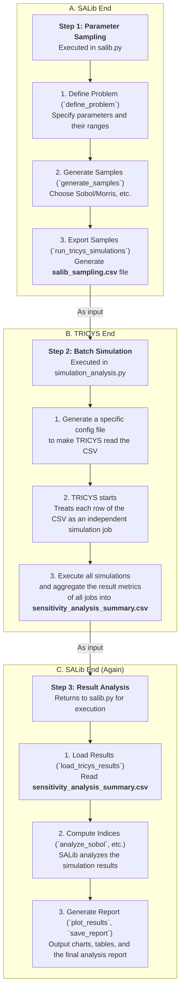

# TRICYS and SALib Integration: Achieving Global Sensitivity Analysis

TRICYS is deeply integrated with the industry-leading sensitivity analysis library **SALib** to provide users with a powerful, automated workflow for Global Sensitivity Analysis (GSA) and Uncertainty Quantification (UQ). This document introduces SALib and its core methods, and provides a detailed breakdown of how TRICYS collaborates with SALib through a three-step process.

## 1. Introduction to SALib and its Analysis Methods

### 1.1. What is SALib?

**SALib** is an open-source Python library specifically designed for conducting sensitivity analysis. Sensitivity analysis aims to study how the uncertainty in the output of a model can be apportioned to different sources of uncertainty in its inputs. In simple terms, it helps us answer a core question: "**Which input parameters have the greatest impact on the model's output?**"

For complex simulation models like TRICYS, GSA is crucial because it helps us:

*   **Identify Key Parameters**: Find the few parameters that have the most significant impact on system performance (e.g., startup inventory, doubling time) from a multitude of parameters.
*   **Understand Parameter Interactions**: Reveal complex non-linear or interactive effects between parameters.
*   **Simplify Models**: After identifying unimportant parameters, they can be fixed as constants in future studies, thereby reducing model complexity and computational cost.

### 1.2. Core SALib Methods Supported by TRICYS

The `TricysSALibAnalyzer` class in TRICYS integrates several of the most common and powerful analysis methods from SALib:

#### Sobol Analysis (Variance-Based Method)
*   **Type**: Global Sensitivity Analysis (GSA), based on variance decomposition.
*   **Core Indices**:
    *   **First-order index (S1)**: Measures the direct contribution of a single parameter's variance to the output variance, i.e., the "main effect." A higher S1 value indicates a greater independent impact of the parameter.
    *   **Total-order index (ST)**: Measures the total contribution of a single parameter, including all its interactions with other parameters, to the output variance.
*   **Interpretation**: If a parameter's `ST` value is significantly larger than its `S1` value, it indicates that the parameter has strong non-linear effects or significant interactions with other parameters.
*   **Characteristics**: The results are very reliable and comprehensive, but it is computationally expensive and typically requires a large number of samples (`N * (2D + 2)`, where D is the number of parameters).

#### Morris Analysis (Screening Method)
*   **Type**: Global Sensitivity Analysis, a trajectory-based screening method.
*   **Core Indices**:
    *   **μ* (mu_star)**: Measures the overall influence of a parameter on the output, representing the mean of the absolute values of the elementary effects. A higher μ* indicates a more important parameter.
    *   **σ (sigma)**: Measures the standard deviation of the elementary effects. A higher σ indicates that the parameter's effect is non-linear or has interactions with other parameters.
*   **Characteristics**: It is computationally very efficient, especially suitable for the early exploratory stages of high-dimensional models (with a large number of input parameters) to quickly screen for the most influential parameters.

#### FAST Analysis (Fourier Amplitude Sensitivity Test)
*   **Type**: Global Sensitivity Analysis, frequency-based.
*   **Core Indices**: Similar to Sobol, it calculates first-order (S1) and total-order (ST) indices.
*   **Characteristics**: In some cases, it is more computationally efficient than the Sobol method, but it has certain requirements for model applicability.

#### Latin Hypercube Sampling (LHS) and Uncertainty Analysis
*   **Type**: Uncertainty Quantification (UQ).
*   **Purpose**: LHS itself is an advanced parameter sampling technique designed to efficiently cover the entire parameter space. When used in conjunction with TRICYS for analysis, its purpose is **not to calculate sensitivity indices** but to study the **statistical distribution characteristics** of the output metrics (mean, std, percentiles) given the uncertainty in the inputs.
*   **Core Metrics**:
    *   Mean, standard deviation, maximum/minimum values.
    *   Percentiles (e.g., 5% and 95%) to assess the confidence interval of the output.
*   **Interpretation**: Through LHS analysis, we can understand the stability and fluctuation range of the model's output and evaluate its risks in the face of input uncertainties.

## 2. The Three-Step Integration Workflow

TRICYS breaks down the complex GSA process into a clear, automated three-step workflow. The `TricysSALibAnalyzer` class is responsible for orchestrating the entire process, with the core idea being **"SALib handles sampling and analysis, while TRICYS handles execution,"** with the two exchanging data via CSV files.



### Step 1: Parameter Sampling (SALib -> CSV)

This stage is entirely completed within the `TricysSALibAnalyzer` class in `salib.py`, with the goal of generating a CSV file containing all parameter combinations.

1.  **Define Problem**: By calling `define_problem()`, the user needs to provide a dictionary containing all the parameters to be analyzed and their value ranges (bounds).
2.  **Generate Samples**: Call `generate_samples()` and specify the sampling method (e.g., `'sobol'`) and the number of samples `N`. SALib will generate a series of parameter points in the defined parameter space according to the chosen method.
3.  **Export File**: Call the `run_tricys_simulations()` function (note: despite its name, this function **does not execute simulations**). This function writes all the parameter samples generated in the previous step into a file named `salib_sampling.csv`. This file acts as the bridge connecting SALib and TRICYS.

### Step 2: Batch Simulation (TRICYS Reads CSV)

This stage is orchestrated by the `run_salib_analysis()` function in `simulation_analysis.py`, which calls TRICYS's core simulation engine to perform the calculations.

1.  **Generate Specific Configuration**: The `generate_tricys_config()` function in `salib.py` creates a temporary TRICYS configuration file. The key aspect of this configuration file is that it points `simulation_parameters` to the `salib_sampling.csv` file generated in the previous step.
    ```json
    "simulation_parameters": {
      "file": "/path/to/salib_sampling.csv"
    }
    ```
2.  **TRICYS Startup and Execution**: When `simulation_analysis.py` starts with this special configuration, it recognizes it as a file-based task. TRICYS will **read `salib_sampling.csv` line by line**, treating each row (i.e., a complete set of parameters) as an independent simulation job.
3.  **Aggregate Results**: TRICYS will execute all simulation jobs (either concurrently or sequentially). Once all tasks are complete, it will aggregate the performance metrics calculated from each job (e.g., `Startup_Inventory`) and generate a result file named `sensitivity_analysis_summary.csv`. Each row in this file corresponds to a row of input from `salib_sampling.csv`, thus perfectly matching the input parameters with the output results.

### Step 3: Result Analysis and Reporting (SALib Reads Results)

After the simulation is complete, control returns to `salib.py` for final analysis and report generation.

1.  **Load Results**: The `load_tricys_results()` function reads `sensitivity_analysis_summary.csv` to load TRICYS's calculation results into memory.
2.  **Calculate Sensitivity Indices**: Based on the user's chosen analysis method, the corresponding analysis function, such as `analyze_sobol()`, is called. This function feeds the parameter samples and simulation results together into SALib's analysis engine to calculate sensitivity indices like S1, ST, etc.
3.  **Generate Report**: Finally, functions like `plot_*_results()` and `_save_sensitivity_report()` use the calculated indices to generate a series of visualizations (e.g., bar charts, μ*-σ plots), data tables, and a complete Markdown analysis report (which also supports AI-enhanced in-depth interpretation).

Through these three clear steps, TRICYS successfully decouples and integrates SALib's powerful sampling and analysis capabilities with its own efficient simulation execution capabilities, providing a fully automated GSA workflow from problem definition to final report.
