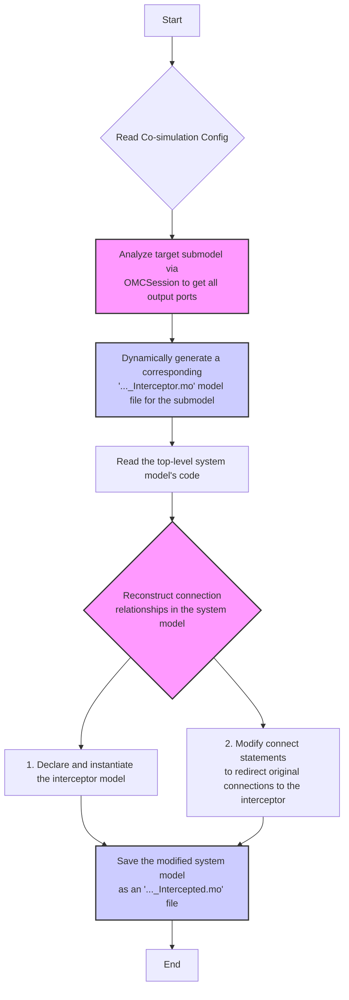
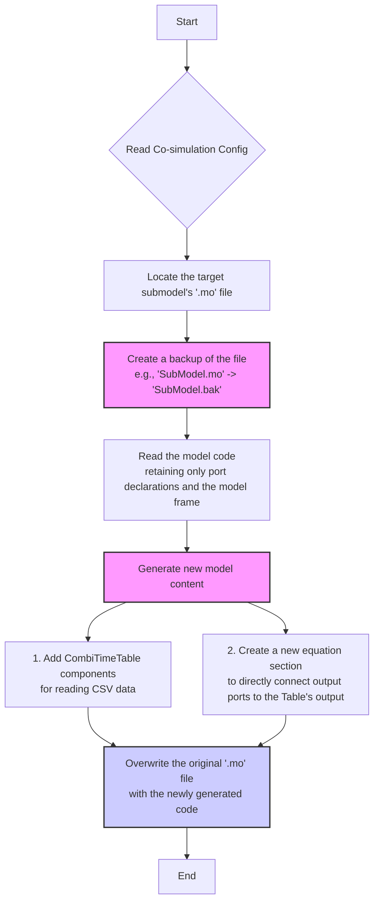

In co-simulation, TRICYS provides two methods for injecting external data into a Modelica model.

## 1. Interceptor Mode

### 1.1. How It Works

The interceptor mode is a **non-invasive** method for data injection. It does not modify any original model files; instead, it works by automatically generating new models.

The core idea is to dynamically insert a new "interceptor" model between the original submodel and downstream components. This interceptor acts like a configurable switch, receiving both the real-time output signals from the **original submodel** and predefined data from a **CSV file**. By setting model parameters at runtime, you can precisely control whether each output signal "passes through" the upstream real-time signal or is "overridden" with data from the CSV file.

The advantage of this mode lies in its safety and flexibility. All modifications are made on automatically generated copies (e.g., `_Intercepted.mo`), leaving the original model and system design unchanged. This makes it ideal for "what-if" analysis, fault injection, or temporarily replacing parts of the system's behavior.

### 1.2. Architecture Diagram

```
Original System Structure:
  [Upstream Model] --> [Submodel] --> [Downstream Model]

Interceptor Mode Structure:
  [Upstream Model] --> [Submodel] --> [Interceptor] --> [Downstream Model]
                                     ↑
                                 [CSV Data]
```

### 1.3. Implementation Steps

`tricys` automatically completes the following steps to implement the interceptor mode:



Detailed breakdown of steps:
1.  **Analyze Model**: `tricys` first uses the OpenModelica (OMC) toolchain to analyze the target submodel, automatically identifying all its output ports, dimensions, and other metadata.
2.  **Generate Interceptor**: Based on the port information obtained in the previous step, a new Modelica model (`..._Interceptor.mo`) is dynamically generated. This model contains a `CombiTimeTable` component (for reading CSVs) and data selection logic.
3.  **Modify System**: `tricys` reads the code of the top-level system model and performs the following modifications:
    *   **Instantiate Interceptor**: An instance declaration for the newly generated interceptor model is added before the `equation` section.
    *   **Redirect Connections**: `connect` statements are automatically found and modified using regular expressions. The original connections from the submodel's output ports to downstream components are broken and rerouted through the interceptor:
        *   `Submodel.OutputPort` -> `Interceptor.PhysicalInputPort`
        *   `Interceptor.FinalOutputPort` -> `DownstreamComponent.InputPort`
4.  **Save New System**: The content of the modified top-level system model is saved to a new file with an `_Intercepted` suffix, ensuring the original system model file remains unaffected.

### 1.4. Interceptor Model Example

```modelica
within example_model;

model Plasma_Interceptor
  // Receive original model output
  Modelica.Blocks.Interfaces.RealInput physical_to_Pump[5];
  
  // Final output
  Modelica.Blocks.Interfaces.RealOutput final_to_Pump[5];
  
  protected
    parameter String fileName = "plasma_data.csv";
    
    // Column mapping parameter: [time, y1, y2, y3, y4, y5]
    // If a column is set to 1, it means use physical data instead of CSV
    parameter Integer columns_to_Pump[6] = {1, 2, 3, 4, 5, 6};
    
    // CSV reader
    Modelica.Blocks.Sources.CombiTimeTable table_to_Pump(
      tableName="csv_data_to_Pump",
      fileName=fileName,
      columns=columns_to_Pump,
      tableOnFile=true
    );
  
  equation
    // Select data source element-wise
    for i in 1:5 loop
      final_to_Pump[i] = if columns_to_Pump[i+1] <> 1 
                         then table_to_Pump.y[i]   // Use CSV
                         else physical_to_Pump[i]; // Use physical data
    end for;

end Plasma_Interceptor;
```

---

## 2. Direct Replacement Mode

### 2.1. How It Works

The direct replacement mode is an **invasive** but efficient method. It directly modifies the target submodel's file, completely replacing its original internal logic with a "data player."

The workflow is as follows: `tricys` first creates a backup file (`.bak`) for the target submodel. Then, it "clears" all internal equations and variables from the original model file, retaining only its input/output port declarations. Next, it adds `CombiTimeTable` components to the model and directly connects the output ports to the data outputs of these components.

Ultimately, the submodel becomes a simple data source whose behavior is entirely defined by an external CSV file. This mode is suitable when you need to permanently or semi-permanently replace a computationally expensive or temporarily unavailable submodel with a fixed dataset (e.g., results from a high-fidelity simulation or experimental data).

### 2.2. Architecture Diagram

```
Original System Structure:
  [Upstream Model] --> [Submodel] --> [Downstream Model]

Direct Replacement Mode:
  [Upstream Model] --> [Submodel (CSV Version)] --> [Downstream Model]
                             ↑
                         [CSV Data]
```

### 2.3. Implementation Steps

`tricys` implements direct replacement through the following automated process:



Detailed breakdown of steps:
1.  **Locate and Backup**: Based on the `submodel_name`, `tricys` finds the corresponding `.mo` file in the project directory and immediately creates a backup file with a `.bak` suffix to prevent data loss.
2.  **Parse and Clear**: The program reads the original model code and parses its complete input/output port declarations. It then discards all other content in the model, such as variables in the `parameter` and `protected` sections, and all equations in the `equation` section.
3.  **Generate New Code**: `tricys` generates brand new model code based on the parsed port information:
    *   It retains the original port declarations to ensure its external interface remains unchanged.
    *   For each output port that needs to be driven by CSV data, it adds a `CombiTimeTable` instance and configures parameters like `fileName` and `columns`.
    *   It creates a new `equation` section with simple mapping statements like `output_port = table.y` to directly connect the output ports to the `CombiTimeTable`'s data outputs.
4.  **Overwrite File**: Finally, `tricys` completely overwrites the original `.mo` file with the newly generated code, completing the replacement process. Since the submodel's interface (ports) has not changed, the top-level system model requires no modifications.

### 2.4. Post-Replacement Model Example

```modelica
within example_model;

model Plasma
  // Original port declarations remain unchanged
  Modelica.Blocks.Interfaces.RealInput pulseInput;
  Modelica.Blocks.Interfaces.RealOutput from_Fueling_System[5];
  Modelica.Blocks.Interfaces.RealOutput to_FW[5];
  Modelica.Blocks.Interfaces.RealOutput to_Div[5];
  Modelica.Blocks.Interfaces.RealOutput to_Pump[5];

protected
  parameter String fileName = "plasma_data.csv";
  
  // CSV Data Source
  Modelica.Blocks.Sources.CombiTimeTable table_to_Pump(
    tableName="csv_data_to_Pump",
    fileName=fileName,
    columns={1, 2, 3, 4, 5, 6},  // time + 5 data columns
    tableOnFile=true
  );
  
  Modelica.Blocks.Sources.CombiTimeTable table_to_FW(
    tableName="csv_data_to_FW",
    fileName=fileName,
    columns={1, 7, 8, 9, 10, 11},
    tableOnFile=true
  );
  
  // ... table definitions for other ports ...

equation
  // Directly map CSV to output (ignoring input)
  for i in 1:5 loop
    to_Pump[i] = table_to_Pump.y[i];
    to_FW[i] = table_to_FW.y[i];
    to_Div[i] = table_to_Div.y[i];
    from_Fueling_System[i] = table_from_Fueling_System.y[i];
  end for;

end Plasma;
```

---

## 3. Writing Your Own Handler

Besides using the built-in processors, the most powerful feature of the `tricys` co-simulation framework is the ability to write your own Python functions (handlers) to dynamically generate data for injection into the Modelica model. This means you can integrate any complex external models, algorithms, or data sources.

### 3.1. Handler Configuration

In the `co_simulation.handlers` list in `config.json`, each handler object contains the following fields to define its behavior:

- **`handler_module` or `handler_script_path`** (string, one is required):
    - **`handler_module`**: Specifies the full path of the **Python module** where the handler function is located. Suitable for cases where the code is part of a standard Python package.
    - **`handler_script_path`**: Specifies the path to the **Python script file** containing the handler function. This is more flexible and suitable for standalone script files.

- **`handler_function`** (string, required):
    - **Description**: The name of the function to be called within the specified module or script.

- **`params`** (dictionary, optional):
    - **Description**: A dictionary containing arbitrary keyword arguments to be passed to the handler function.

### 3.2. Function Signature and Responsibilities

To be correctly called by the `tricys` framework, your handler function **must** follow a specific signature. The framework automatically passes two core paths via **keyword arguments**, which your function needs to define and accept:

```python
def my_handler(temp_input_csv: str, temp_output_csv: str, **kwargs) -> dict:
    """
    A standard handler function signature.
    
    Args:
        temp_input_csv (str): The path to a CSV file containing the output results
                              from the upstream model. You can read this file
                              to get the inputs that drive your calculation.
        temp_output_csv (str): The path to a target CSV file where you need to
                               write your calculation results. tricys will provide
                               this file to Modelica's CombiTimeTable.
        **kwargs: Used to receive all custom parameters from "params" in the JSON config.

    Returns:
        dict: A dictionary used to configure the column mapping for the Modelica CombiTimeTable.
    """
    # ... Your code logic here ...
```

**Core Responsibilities**:
1.  **Read Input (Optional)**: Use Pandas or another library to read the `temp_input_csv` file and get the dynamic output from the upstream model.
2.  **Perform Calculation**: Run your model, algorithm, or any other logic.
3.  **Write Output**: Save your calculation results (which must include a `time` column) in CSV format to the path specified by `temp_output_csv`.

### 3.3. Return Value

The handler function **must** return a dictionary. The **keys** of this dictionary correspond to the **output port names** of the Modelica submodel, and the **values** are strings used to configure the `columns` parameter of the `CombiTimeTable`, defining how to read data columns from your generated CSV file.

- **Example**: `return {"to_CL": "{1,2,3,4,5,6}"}`
  - This tells `tricys` that for the output port named `to_CL`, the generated `CombiTimeTable` should use columns 1 through 6 of the data you wrote in `temp_output_csv` (where column 1 is typically `time`).

### 3.4. Complete Example

Taking the built-in `div_handler.py` as an example, it simulates a simple external model that does not depend on upstream input but generates its own data.

**Step 1: Create the Handler Script**

```python
# tricys/handlers/div_handler.py

import os
import pandas as pd

def run_div_simulation(temp_input_csv, temp_output_csv, **kwargs):
    """
    A simple handler that reads a predefined CSV file and writes its content
    to the target output path specified by the framework.
    """
    # Get the directory of the current file to locate the data file
    handler_dir = os.path.dirname(__file__)
    source_csv_path = os.path.join(handler_dir, "div_handler.csv")

    # Read the source data
    source_df = pd.read_csv(source_csv_path)

    # Define the columns to be output to Modelica
    columns_to_select = [
        "time",
        "div.to_CL[1]", "div.to_CL[2]", "div.to_CL[3]",
        "div.to_CL[4]", "div.to_CL[5]",
    ]
    output_df = source_df[columns_to_select].copy()

    # Write the processed data to the target CSV file specified by the framework
    output_df.to_csv(temp_output_csv, index=False)

    # Return the mapping between ports and columns
    output_placeholder = {"to_CL": "{1,2,3,4,5,6}"}
    return output_placeholder
```

**Step 2: Configure in `config.json`**

```json
"co_simulation": {
    "mode": "interceptor",
    "handlers": [
        {
            "submodel_name": "example_model.DIV",
            "instance_name": "div",
            "handler_module": "tricys.handlers.div_handler",
            "handler_function": "run_div_simulation",
            "params": {}
        }
    ]
}
```

In this configuration, `tricys` will:
1.  Import the `tricys.handlers.div_handler` module.
2.  Call the `run_div_simulation` function.
3.  After the function executes, a new CSV file is generated.
4.  Use the returned `{"to_CL": "{1,2,3,4,5,6}"}` to configure the `CombiTimeTable` injected into the Modelica simulation.