## 1. Simulation Execution Flow

The core simulation flow of `tricys` is driven by the `tricys/simulation/simulation.py` script. It is designed as a highly configurable and robust orchestration engine for simulation business processes, capable of handling everything from simple single runs to complex multi-parameter, multi-mode (standard/co-simulation) simulations.

Below is a complete flowchart and a detailed explanation of the steps involved.

## 2. Detailed Flowchart

```mermaid
graph TD
    %% 1. Initialization Phase
    subgraph S1 ["1. Initialization"]
        A[Start: Provide Config File] --> B[Read and Prepare Configuration]
        B --> C[Set Up Logging]
    end

    %% 2. Job Generation Phase
    subgraph S2 ["2. Job Generation"]
        C --> D[Generate Simulation Jobs based on simulation_parameters]
    end

    %% 3. Decision Phase
    subgraph S3 ["3. Execution Mode Decision"]
        D --> E{co_simulation config detected?}
        E -- Yes --> F[Co-simulation Flow]
        E -- No --> G[Standard Simulation Flow]
        
        G --> H{Use concurrent mode?}
        H -- Yes --> I[Execute multiple _run_single_job in parallel]
        H -- No --> J[Execute _run_sequential_sweep sequentially]

        F --> K{Use concurrent mode?}
        K -- Yes --> L[Execute multiple _run_co_simulation in parallel]
        K -- No --> M[Execute multiple _run_co_simulation sequentially]
    end

    %% 4. Loop Entry Points
    subgraph S4 ["4. Job Execution Entry"]
        J --> N((Standard Simulation Loop))
        I --> N

        M --> O((Co-simulation Loop))
        L --> O
    end
    
    %% Detailed Flow - Standard Simulation
    subgraph S5 ["Standard Simulation (_run_single_job / _run_sequential_sweep)"]
        N --> N1[Create Independent Workspace - Parallel Mode]
        N1 --> N2[Get OMPython Session]
        N2 --> N3[Load Modelica Model]
        N3 --> N4[Set Simulation Parameters]
        N4 --> N5[Execute simulate]
        N5 --> N6[Clean and Save Result CSV]
        N6 --> P[Return Result File Path]
    end

    %% Detailed Flow - Co-simulation
    subgraph S6 ["Co-simulation (_run_co_simulation)"]
        O --> O1[1. Create Independent Workspace]
        O1 --> O2[2. Copy Models and Asset Files]
        O2 --> O3[3. Stage 1: Run Preliminary Simulation to Generate Handler Inputs]
        O3 --> O4[4. Dynamically Load Python Handler Function]
        O4 --> O5[5. Execute Handler to Generate External Data CSV]
        O5 --> O6[6. Create and Integrate Interceptor Model]
        O6 --> O7[7. Stage 2: Run Final Simulation with Interceptor Model]
        O7 --> O8[8. Clean and Save Final Result CSV]
        O8 --> P
    end
    
    %% 5. Result Aggregation
    subgraph S7 ["5. Result Aggregation"]
        P --> Q{Collect Result Paths from All Jobs}
        Q --> R[Read Each Result CSV]
        R --> S["Append Parameters to Variable Column Names (e.g., 'var&p1=v1')"]
        S --> T[Merge All Results into a Single DataFrame]
        T --> U[Save as 'sweep_results.csv']
    end

    %% 6. Post-processing
    subgraph S8 ["6. Post-processing"]
        U --> V{post_processing config detected?}
        V -- Yes --> W[Dynamically Load and Execute Post-processing Functions]
        V -- No --> X[Skip Post-processing]
    end

    %% 7. Cleanup and End
    subgraph S9 ["7. Cleanup and End"]
        W --> Y[Clean Up Temporary Files and Directories]
        X --> Y
        Y --> Z[End]
    end
```

## 3. Detailed Explanation of the Flow

### 3.1. Initialization
- **Read and Prepare Configuration**: The process starts with a JSON configuration file. `tricys` reads this file, parses all paths, simulation settings, and parameters, and prepares an internal configuration object.
- **Set Up Logging**: Based on the logging settings in the configuration file, a global logger is initialized to record detailed steps, warnings, and errors throughout the entire process.

### 3.2. Job Generation
- `tricys` checks the `simulation_parameters` section in the configuration. If a parameter sweep is defined (e.g., a parameter has multiple values), it generates an independent "job" for each parameter combination. If no parameter sweep is defined, only a single default job is generated.

### 3.3. Execution Mode Decision
This is a critical branching point in the flow where `tricys` decides how to execute the generated jobs based on the configuration:
- **Standard vs. Co-simulation**: It first checks for the presence of a `co_simulation` configuration block. If it exists, the [co-simulation flow](../co_simulation_module.md) is initiated; otherwise, the standard simulation flow is followed.
- **Parallel vs. Sequential**: Next, it checks the `simulation.concurrent` flag. If `true`, `tricys` uses a [concurrent mode](concurrency.md) (multi-threading or multi-processing) to execute multiple jobs simultaneously. If `false`, the jobs are executed sequentially, one after another.

These four combinations (Standard/Sequential, Standard/Parallel, Co-simulation/Sequential, Co-simulation/Parallel) correspond to different execution functions to achieve optimal performance and isolation.

### 3.4. Job Execution
Each job is executed in an independent, isolated workspace to prevent file conflicts.

- **Standard Simulation Flow (`_run_single_job` / `_run_sequential_sweep`)**:
  1. Obtain an `OMPython` session.
  2. Load the specified Modelica model package.
  3. Apply the parameters for the current job to the model.
  4. Call `simulate()` to execute the simulation.
  5. Clean the generated `_res.csv` result file (e.g., remove duplicate time points) and return its path.

- **Co-simulation Flow (`_run_co_simulation`)**:
  This is a more complex, multi-stage process used to integrate a Modelica model with external Python logic (called a "Handler"):
  1. **Create Workspace**: Create a completely isolated temporary directory for the job.
  2. **Copy Assets**: Copy the model files (`.mo`) and any external files the Handler might need (like CSVs, lookup tables, etc.) to the workspace.
  3. **Stage 1: Preliminary Simulation**: Run an initial simulation. The purpose of this run is not to get the final results, but to generate the input signals required by the Handler. For example, if an external controller needs to know the current system temperature and pressure, this simulation will export the time series of these variables to `primary_inputs.csv`.
  4. **Execute Handler**: `tricys` dynamically loads the Python Handler function specified in the configuration file.
  5. **Generate External Data**: The Handler function is called. It reads `primary_inputs.csv`, executes its internal logic (e.g., a PID algorithm or a machine learning model), and then generates an output CSV file (e.g., `handler_outputs.csv`).
  6. **Integrate Interceptor**: `tricys` generates a new Modelica model (called an [interceptor model](co_simulation.md)) that can read the data from `handler_outputs.csv` and inject it as input into the main model, thereby replacing or "intercepting" a part of the original model.
  7. **Stage 2: Final Simulation**: Run the final, complete simulation using this new, modified, and intercepted model.
  8. **Save Results**: Clean the final simulation results and return its path.

### 3.5. Result Aggregation
After all jobs have finished executing:
1. `tricys` collects the result file paths from each successful job.
2. It reads each of these CSV files one by one and merges them into a single large Pandas DataFrame.
3. To distinguish data from different jobs, it renames the variable columns by appending the parameters that produced the data. For example, if a job's parameters were `{"freq": 10}`, the original `voltage` column would become `voltage&freq=10`.
4. Finally, this merged DataFrame is saved as `sweep_results.csv` (for parameter sweeps) or `simulation_result.csv` (for single runs).

### 3.6. Post-processing
If `post_processing` tasks are defined in the configuration file, `tricys` executes them at this point. It dynamically loads the specified Python functions and passes the merged results DataFrame generated in the previous step as input. This allows users to seamlessly connect custom [analysis, plotting, or report generation scripts](../../guides/tricys_basic/post_processing_module.md).

### 3.7. Cleanup and End
- Unless `keep_temp_files: true` is set in the configuration, `tricys` automatically deletes all temporary workspaces and files created during execution.
- The process ends.