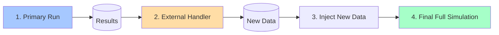

# Co-Simulation Module

Co-Simulation is an advanced and powerful feature in `tricys` that allows Modelica models to interact with external programs (like Aspen Plus, MATLAB, or custom Python scripts), enabling the integration of 0D system models with 3D sub-module multi-physics models.

This is particularly useful for the following scenarios:

- A model for a subsystem already exists and is well-established in another specialized software.
- The behavior of a subsystem is too complex to be described directly in the Modelica language but can be calculated externally.

## 1. Workflow

The core idea of co-simulation is "**Run-Process-Rerun**".



1.  **Primary Run**: `tricys` first runs a preliminary simulation without the substituted subsystem.
2.  **Call Handlers**: The results of the primary run are passed to one or more user-defined "handlers".
3.  **External Computation**: The handler function receives the results and calls an external program (like Aspen) or executes an internal algorithm to compute new data.
4.  **Data Injection**: The handler returns a data dictionary. `tricys` dynamically creates a new top-level model, replacing the original subsystem with a `CombiTimeTable` (data table) module, and uses the data returned by the handler as the content for this table.
5.  **Final Run**: `tricys` runs this dynamically modified new model, which contains the injected data, to complete a full co-simulation.

## 2. Configuration File Example

Enable this feature by defining the `co_simulation` field in `config.json`.

```json
{
    "paths": { ... },
    "simulation": { ... },
    "simulation_parameters": { ... },
    "co_simulation": {
        "mode": "replacement",
        "handlers":[
            {
                "submodel_name": "example_model.I_ISS",
                "instance_name": "i_iss",
                "handler_module": "tricys.handlers.i_iss_handler",
                "handler_function": "run_dummy_simulation",
                "params": {
                    "description": "This is a dummy handler for i_iss.",
                    "dummy_value": 123.45
                }
            },
            {
                "submodel_name": "example_model.DIV",
                "instance_name": "div",
                "handler_module": "tricys.handlers.div_handler",
                "handler_function": "run_div_simulation",
                "params": {
                    "description": "This is a dummy handler for i_iss.",
                    "dummy_value": 123.45
                }
            }
        ]
    }
}
```

## 3. Configuration Details

### 3.1. `co_simulation` (Top-level Object)

| Parameter | Type & Requirement | Description |
| :--- | :--- | :--- |
| `mode` | string, optional | Defines the integration mode for co-simulation. Defaults to `"interceptor"`. |
| `handlers` | list, required | A list of one or more "handler configuration objects", each defining how to process a specific submodel. |

### 3.2. `mode` (Integration Mode)

The `mode` field determines how `tricys` integrates the external computation results back into the Modelica model.

-   `"interceptor"` (default mode):
    -   **Non-invasive**. It generates a "wrapper" interceptor model for the target submodel and redirects connections in a new top-level system model.
    -   **Advantages**: The original model files (both submodel and top-level model) remain unchanged, ensuring high safety.
    -   **Use Case**: Recommended for most situations, especially when you do not want to modify the original model library.

-   `"replacement"`:
    -   **Invasive**. It directly modifies the target submodel's `.mo` file (a `.bak` backup is created), completely replacing its internal logic with logic to read data from a CSV file.
    -   **Advantages**: More direct implementation, no need to generate a new top-level model.
    -   **Use Case**: When you want a permanent or semi-permanent replacement of a submodel's behavior, or in complex model structures where the "interceptor" mode has difficulty redirecting connections.

### 3.3. `handlers` (Configuration Object List)

Each object in the `handlers` list defines a specific replacement task.

| Parameter | Type & Requirement | Description |
| :--- | :--- | :--- |
| `submodel_name` | string, required | The full Modelica class path of the submodel to be replaced by an external handler. E.g., `example_model.DIV`. |
| `instance_name` | string, required | The **instance name** of this submodel in the top-level simulation model (`simulation.model_name`). E.g., if the top-level model has `DIV div;`, then the `instance_name` here is `div`. |
| `handler_script_path` | string, recommended | The relative or absolute path to the Python **script file** containing the handler logic. This is the preferred method for specifying a handler. |
| `handler_module` | string, compatible | The path to the Python **module** containing the handler logic (e.g., `tricys.handlers.div_handler`). Used for backward compatibility. If `handler_script_path` is also provided, the script path takes precedence. |
| `handler_function` | string, required | The name of the handler function to be called within the script or module. |
| `params` | dictionary, optional | A dictionary containing key-value pairs that will be passed as keyword arguments to the handler function. |

## 4. Result Output

The final output of a co-simulation is similar to a standard simulation, generating a combined CSV file in the results directory (`results_dir`) based on the number of tasks:

-   **Single Run**: `simulation_result.csv`
-   **Parameter Sweep**: `sweep_results.csv`

In this file, the variable columns corresponding to the externally simulated submodel will be populated with data generated by your Python handlers, not from the original Modelica model's calculations.


## 5. Custom Handlers

To truly leverage the power of co-simulation, you need to create your own handler functions.

### 5.1. Handler Function Specification

Your handler must adhere to the following specifications:

1.  **Function Signature**:
    ```python
    def my_handler(temp_input_csv: str, temp_output_csv: str, **params) -> dict:
        # ... function body ...
    ```
    - `temp_input_csv`: The **input file path** passed by `tricys`. This CSV file contains all the input port data for the submodel, recorded during the first simulation stage.
    - `temp_output_csv`: The **output file path** where you need to write your calculation results.
    - `**params`: A dictionary containing all the `params` you configured for this handler in `config.json`.

2.  **Core Logic**:
    - Read data from `temp_input_csv` using `pandas` or another library.
    - Execute your core computation logic.
    - Save the results (which **must include a 'time' column**) to the path specified by `temp_output_csv`.

3.  **Return Value (Important)**:
    - The function **must** return a dictionary that describes how to map the data columns in your output CSV file to the output ports of the Modelica submodel.
    - **Key**: The name of the Modelica submodel's output port (string).
    - **Value**: A string representing a Modelica array, in the format `"{t, y1, y2, ...}"`. Here, `t` is the index of the `time` column (usually 1), and `y1`, `y2`... are the indices of the data columns for each dimension of the port.

### 5.2. Handler Example

Suppose we want to replace a Modelica submodel `MySubModel` that has a 5-dimensional output port `to_O_ISS`.

**`my_div_handler.py`:**
```python
import pandas as pd

def run_div_simulation(temp_input_csv: str, temp_output_csv: str, **params) -> dict:
    """
    A simple handler example.
    It reads the input, multiplies all input values by a factor from the configuration, and writes them back.
    """
    # Print the parameters passed from config.json
    factor = params.get("factor", 1.0)
    print(f"Running DIV handler with factor: {factor}")

    # 1. Read input data
    input_df = pd.read_csv(temp_input_csv)

    # 2. Perform calculation (Example: multiply all inputs by a factor)
    # Assume input port names are 'div.from_plasma[1]' to '[5]'
    output_df = pd.DataFrame()
    output_df['time'] = input_df['time']
    for i in range(1, 6):
        input_col_name = f'div.from_plasma[{i}]'
        output_col_name = f'to_O_ISS_{i}' # Custom column name in the CSV
        if input_col_name in input_df.columns:
            output_df[output_col_name] = input_df[input_col_name] * factor
        else:
            output_df[output_col_name] = 0 # Output 0 if input does not exist

    # 3. Write the results to the specified output CSV file
    output_df.to_csv(temp_output_csv, index=False)

    # 4. Return the mapping from port to CSV columns
    # The CSV has 6 columns: time, to_O_ISS_1, ..., to_O_ISS_5
    # The Modelica port to_O_ISS is 5-dimensional
    # Mapping:
    # time -> column 1
    # to_O_ISS[1] -> column 2 (to_O_ISS_1)
    # to_O_ISS[2] -> column 3 (to_O_ISS_2)
    # ...
    # to_O_ISS[5] -> column 6 (to_O_ISS_5)
    return {
        "to_O_ISS": "{1,2,3,4,5,6}"
    }
```

### 5.3. Updating the Configuration File

Now, you can update your `config.json` to use this new local handler script. We recommend using `handler_script_path` as it is more direct than `handler_module`.

You can also explicitly specify the co-simulation `mode`.

```json
{
    ...
    "co_simulation": {
        "mode": "interceptor", // "interceptor" (default) or "replacement"
        "handlers": [
            {
                "submodel_name": "example_model.DIV",
                "instance_name": "div",
                "handler_script_path": "path/to/my_div_handler.py", // Use script path
                "handler_function": "run_div_simulation",
                "params": {
                    "factor": 1.5 // Custom parameter passed to the function
                }
            }
        ]
    }
}
```

## 6. Advanced: How It Works

- **[Co-Simulation Explanation](../../explanation/co_simulation.md)**: Learn about the two methods for injecting external data into a Modelica model during co-simulation.
