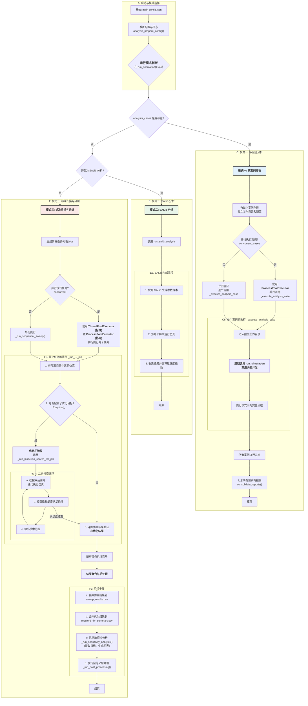

`tricys` 的分析工作流 (`simulation_analysis.py`) 是一个强大的、以分析为导向的自动化流程。它在核心仿真功能之上，构建了复杂的多模式调度、目标寻优和报告生成能力。本篇文档将详细解析其内部的完整工作流程。

## 1. 核心流程图

下面是 `tricys` 分析工作流的完整流程图。它从读取配置开始，智能地选择三种主要操作模式之一，并执行相应的任务直到结束。

## 2. 流程步骤详解

### 2.1. 启动与模式选择

整个流程始于 `main` 函数，它负责加载和预处理配置文件 (`analysis_prepare_config`) 并设置日志系统。核心逻辑位于 `run_simulation` 函数中，它首先会进行**模式判断**，以决定接下来执行哪个核心工作流。

---

### 2.2. 模式一：多案例分析 

当配置文件中定义了 `analysis_cases` 时，此模式被激活。它用于执行一系列独立的、可对比的分析研究。

1.  **环境设置**：框架会为 `analysis_cases` 中的每一个案例创建一个完全独立的子工作目录，并为其生成一份定制化的配置文件。这确保了每个案例的运行环境（包括模型修改、临时文件和结果）都是隔离的。
2.  **并发执行**：如果配置了 `"concurrent_cases": true`，`tricys` 会启动一个**进程池** (`ProcessPoolExecutor`) 来并行执行所有案例。使用进程是至关重要的，因为每个案例都是一个完整的 `tricys` 运行实例，需要独立的内存空间和文件系统权限以避免冲突。
3.  **递归调用**：每个案例的执行由 `_execute_analysis_case` 函数包裹，该函数会**递归地调用 `run_simulation`**，并强制禁用内部的并发执行（防止进程池嵌套）。这意味着每个案例内部会完整地执行一遍“模式三”的流程。
4.  **报告汇总**：所有案例执行完毕后，框架会调用 `consolidate_reports` 等函数，从所有子工作目录中收集分析结果和报告，并生成一份顶层的汇总报告，方便用户进行跨案例的比较。

---

### 2.3. 模式二：SALib 全局敏感性分析

如果配置指向一个全局敏感性分析（GSA）任务（通过 `independent_variable_sampling` 和 `analyzer` 等关键字识别），`tricys` 会将控制权移交给专门的 SALib 工作流。

1.  **调用 `run_salib_analysis`**：这是 SALib 流程的入口。
2.  **参数采样**：使用 SALib 库（如 `saltelli.sample`）根据配置的参数分布生成大量的参数样本集。
3.  **批量仿真**：为每一个参数样本运行一次 Modelica 仿真。
4.  **结果分析**：收集所有仿真结果，并使用 SALib 的分析器（如 `sobol.analyze`）计算每个参数的一阶、二阶和总阶敏感性指数（S1, S2, ST）。
5.  **输出报告**：将敏感性指数和相关图表输出为最终的分析报告。

---

### 2.4. 模式三：标准扫描与分析

这是最基础也是最核心的工作流，当以上两种模式的条件都不满足时，就会执行此流程。

1.  **生成任务**：根据 `simulation_parameters` 生成仿真任务列表 `jobs`。
2.  **执行仿真任务**：
    *   根据 `concurrent` 配置，选择并行或串行执行所有 `jobs`。
    *   每个任务的执行由 `_run_single_job` 或 `_run_co_simulation` 等函数处理。
3.  **优化子流程（核心特色）**：在单次仿真任务执行完毕后，系统会检查是否配置了优化目标（以 `Required_` 为前缀的指标）。
    *   如果存在，系统会立即调用 `_run_bisection_search_for_job`，启动一个**二分搜索循环**。
    *   该循环会为了寻找一个能满足预设指标（例如，氚增殖比TBR > 1.05）的最优参数值，而**迭代地运行多次仿真**，并根据每次的结果动态调整参数，直到找到解或达到最大迭代次数。
4.  **结果聚合**：
    *   所有任务（包括优化子流程中的所有仿真）完成后，框架会聚合两类数据：
        *   所有仿真的原始时间序列数据，合并到 `sweep_results.csv`。
        *   所有优化任务的最终结果（例如，`TBR>1.05` 对应的最优 `enrichment` 是 `0.85`），合并到 `requierd_tbr_summary.csv`。
5.  **最终分析与后处理**：
    *   调用 `_run_sensitivity_analysis`，它会加载聚合后的数据，计算最终的关键性能指标（KPI），并生成分析图表和摘要。
    *   调用 `_run_post_processing`，执行用户自定义的任何最终处理脚本（例如，生成特定的报告格式）。
