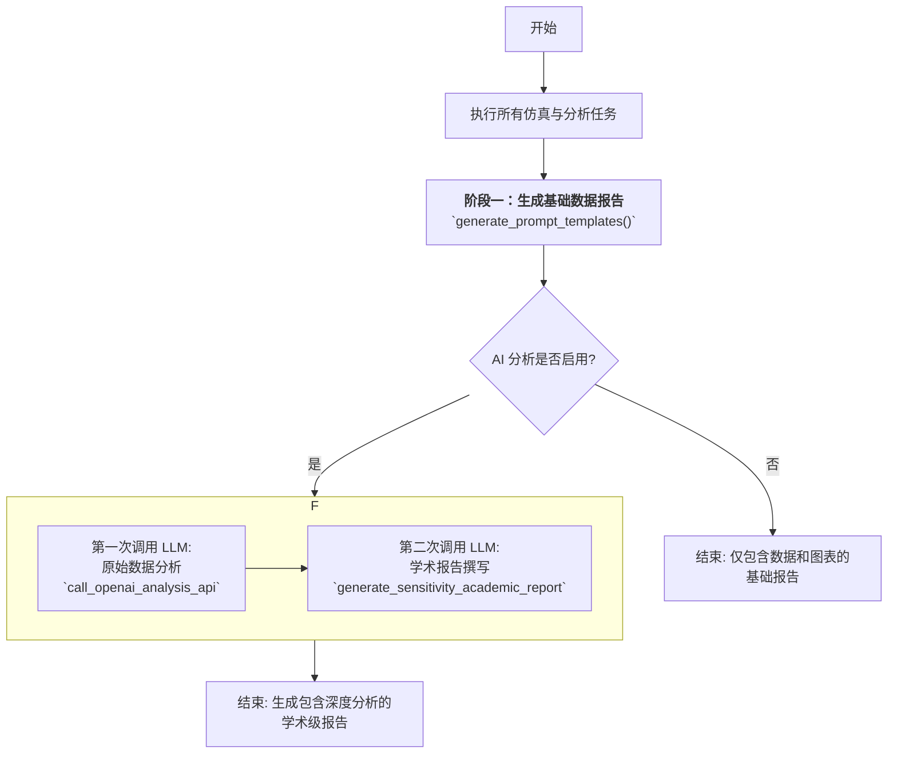

TRICYS 不仅是一个仿真执行框架，更是一个强大的自动化分析与报告平台。它能够将复杂的仿真结果自动处理成结构清晰、内容丰富、支持中英双语的分析报告。其报告生成流程采用创新的分层设计，从数据驱动的图表生成，到可选的、由大语言模型（LLM）驱动的深度分析与学术级报告撰写，实现了端到端的自动化。


## 1. 专业术语与国际化图表

为了使生成的图表具有专业性和可读性，TRICYS 引入了一套基于外部术语表的标签映射机制，并支持中英双语切换。

### 1.1 工作原理

该功能由 `tricys/analysis/plot.py` 模块实现。

1.  **加载术语表**：程序启动时，`load_glossary()` 函数会读取一个用户指定的 CSV 文件（`glossary_path`）。该 CSV 文件定义了内部模型变量名与其中英文专业术语的对应关系。
2.  **设置语言**：通过调用 `set_plot_language('cn')` 或 `set_plot_language('en')`，可以全局切换图表的显示语言。切换至中文时，会自动启用支持中文的字体（如“SimHei”）。
3.  **标签格式化**：在绘制图表时，所有原始的变量名（如 `Startup_Inventory`, `sds.I[1]`）都会经过 `_format_label()` 函数处理。该函数会：
    *   首先，根据当前设置的语言，在加载的术语表中查找对应的中文或英文专业术语。
    *   如果查找到，则使用该专业术语作为图表标签（例如，图例、坐标轴标题）。
    *   如果未找到，则执行默认的格式化（例如，将下划线替换为空格），保证标签的基本可读性。
4.  **单位映射**：除了术语，坐标轴的单位也支持通过 `unit_map` 配置进行转换和显示，并同样支持国际化。

### 1.2 术语表格式示例

该 CSV 文件必须包含以下三列：

| 模型参数 (Model Parameter) | 英文术语 (English Term) | 中文翻译 (Chinese Translation) |
| :--- | :--- | :--- |
| `Startup_Inventory` | Startup Inventory | 启动库存 |
| `Doubling_Time` | Doubling Time | 倍增时间 |
| `sds.I[1]` | Tritium Inventory in SDS | 贮存与输送系统氚库存 |

通过这种机制，TRICYS 能够将内部变量 `Startup_Inventory` 在生成图表时自动美化为“Startup Inventory (kg)”或“启动库存 (千克)”。

## 2. 核心图表类型

`tricys/analysis/plot.py` 中的 `generate_analysis_plots()` 函数是所有分析图表的总入口，它会根据分析任务的类型生成以下几类核心图表：

#### 2.1 主趋势图

*   **用途**：展示关键性能指标（因变量）如何随独立扫描变量的变化而变化。
*   **特点**：
    *   当存在多个背景扫描参数（`simulation_parameters`）时，会自动使用不同的颜色、线型和标记来绘制多条曲线，并生成图例。
    *   如果曲线数量不多，会自动在数据点上标注数值，方便精确读数。
    *   支持将多个指标绘制在同一张图的多个子图中（`_generate_combined_plots`），或为每个指标生成独立的图表文件（`_generate_individual_plots`）。

#### 2.2 约束求解分析图

*   **用途**：专门用于可视化“目标寻优”任务的结果（即 `Required_` 开头的指标）。
*   **特点**：
    *   由 `_generate_multi_required_plot()` 函数生成，通常采用多子图布局。
    *   每个子图代表一组特定的背景参数组合，清晰地展示了在不同场景下，为了达成某个约束条件（例如，倍增时间小于10年），需要付出的“代价”（即被优化的参数值）。
    *   这种图对于理解多变量权衡（Trade-offs）关系至关重要。

#### 2.3 扫描过程时序图

*   **用途**：当需要观察某个动态变量在不同参数扫描下的完整时间演化过程时，生成此图。
*   **特点**：
    *   由 `plot_sweep_time_series()` 函数生成，包含**两个子图**：
        1.  **全局视图 (Overall View)**：展示从 `t=0` 到仿真结束的完整时间曲线。为了突出早期关键行为，此视图会自动隐藏超过初始值两倍的数据点。
        2.  **细节视图 (Detailed View)**：自动聚焦于所有曲线中首次达到最小值的区域，并放大显示。这对于观察系统启动初期的动态特性（如库存的“下跌-回升”转折点）非常有用。
    *   一个红色的虚线框会自动绘制在“全局视图”上，以标示“细节视图”所对应的区域。

## 3. 多阶段报告生成逻辑

TRICYS 的报告生成分为两个核心阶段，由 `tricys/analysis/report.py` 模块调度。这种设计将原始数据与 AI 解读分离，保证了结果的透明度和可追溯性。



### 3.1. 阶段一：基础数据报告

此阶段由 `generate_prompt_templates()` 函数执行，其核心职责是创建一个**内容详尽、纯数据驱动**的 Markdown 文件。这份文件是后续所有分析的“事实根基”，包含：

1.  **配置详情**：本次分析的所有配置参数，如独立/因变量、扫描范围、优化设置等。
2.  **数据表格**：将 `sensitivity_analysis_summary.csv` 和 `requierd_tbr_summary.csv` 中的数据格式化为美观的 Markdown 表格。
3.  **图表嵌入**：将 `plot.py` 生成的所有 `.svg` 图表文件通过 `` 的语法嵌入报告中。
4.  **动态数据切片**：如果适用，还会从 `sweep_results.csv` 中提取关键动态过程（如初始、转折点、结束阶段）的数据切片，以表格形式呈现。

### 3.2. 阶段二：原始数据分析

*   **执行者**：`call_openai_analysis_api()`
*   **目的**：对**纯数据表格**进行深度量化分析，发掘数据背后的趋势与关联。
*   **过程**：
    1.  将阶段一生成的**基础报告**作为上下文，并附加上一个精心设计的分析指令（见下一节）。
    2.  一个关键指令是**忽略图表，只分析表格**，这强制模型进行定量而非定性的分析。
    3.  LLM 返回的分析结果会被**追加**到基础报告的末尾，形成一份包含“原始数据+AI初步解读”的完整报告。

<details>
<summary>数据分析师提示词</summary>

```
**角色：** 你是一名聚变反应堆氚燃料循环领域的专家。
**任务：** 请**完全基于**下方提供的**两类数据表格**，对聚变堆燃料循环模型的**敏感性分析**结果进行深度解读。
**分析要点 (必须严格依据数据表格作答)：**
1.  **全局敏感性分析:**
    *   分析性能指标总表呈现出怎样的**总体趋势**？
    *   哪个性能指标对独立变量 `{independent_variable}` 的变化最为敏感？
2.  **交互效应分析：**
    *   分析独立变量与背景扫描参数之间的交互作用对性能指标的影响。
3.  **动态过程分析:**
    *   观察过程数据切片：系统在“初始阶段”和“结束阶段”的行为有何不同？
    *   转折点阶段的数据揭示了什么物理过程？
4.  **综合结论：**
    *   总结调整 `{independent_variable}` 对系统的综合影响和利弊权衡。
    *   可以得出哪些关于系统设计或运行优化的初步建议？
```

</details>


### 3.3. 阶段三：学术报告撰写

*   **执行者**：`generate_sensitivity_academic_report()`
*   **目的**：将一份包含数据、图表和初步分析的混合报告，**“升格”**为一篇结构严谨、语言专业的学术风格报告。
*   **过程**：
    1.  将**更新后的报告**（已包含第一次AI分析）和**术语表 (`glossary.csv`)** 一同作为上下文。
    2.  附加上一个更复杂的指令，要求模型扮演“资深科学家”角色，并严格遵循学术规范。
    3.  LLM 会利用术语表将报告中的内部变量替换为专业术语，并按照标准的学术结构（摘要、引言、方法、结果与讨论、结论）重新组织和撰写所有内容。
    4.  最终结果保存为一个全新的、可直接使用的学术报告文件 (`academic_report_....md`)。

<details>
<summary>资深科学家提示词</summary>

```
**角色：** 您是一位在核聚变工程，特别是氚燃料循环领域，具有深厚学术背景的资深科学家。
**任务：** 您收到了一个初步报告和一份专业术语表。请您基于这两份文件，撰写一份更加专业、正式、符合学术发表标准的深度分析总结报告。
**指令：**
1.  **专业化语言：** 将初步报告中的模型参数/缩写（例如 `sds.I[1]`, `Startup_Inventory`）替换为术语表中对应的专业术语。
2.  **学术化重述：** 用严谨、客观的学术语言重新组织和阐述初步报告中的发现。
3.  **图表和表格的呈现与引用：**
    *   **显示图表：** 您**必须**使用 Markdown 语法 `` 来**直接嵌入**和显示初步报告中包含的所有图表。
    *   **引用图表：** 在正文中分析和讨论图表内容时，请对图表进行编号和文字引用。
4.  **结构化报告：** 您的报告应包含以下部分：
    *   **标题 (Title):** ...
    *   **摘要 (Abstract):** ...
    *   **引言 (Introduction):** ...
    *   **方法 (Methodology):** ...
    *   **结果与讨论 (Results and Discussion):** ...
    *   **结论 (Conclusion):** ...
```

</details>


