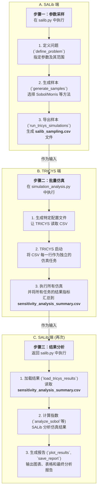

TRICYS 深度集成了业界领先的敏感性分析库 **SALib**，为用户提供了一套强大、自动化的全局敏感性分析（Global Sensitivity Analysis, GSA）和不确定性量化（Uncertainty Quantification, UQ）工作流。本篇文档将介绍 SALib 及其核心方法，并详细解析 TRICYS 是如何通过一个三步流程与 SALib 协同工作的。

## 1. SALib 库及其分析方法简介

### 1.1. 什么是 SALib？

**SALib** 是一个用 Python 编写的开源库，专门用于执行敏感性分析。敏感性分析旨在研究一个模型的输出不确定性，在多大程度上可以归因于其不同输入源的不确定性。简单来说，它帮助我们回答一个核心问题：“**模型中的哪些输入参数对输出结果的影响最大？**”

对于像 TRICYS 这样的复杂仿真模型，GSA 至关重要，因为它可以帮助我们：

*   **识别关键参数**：在众多参数中，找到对系统性能（如启动库存、倍增时间）影响最大的少数几个。
*   **理解参数交互**：揭示参数之间是否存在复杂的非线性或交互效应。


### 1.2. 核心 SALib 方法

TRICYS 的 `TricysSALibAnalyzer` 类集成了 SALib 中几种最常用和最强大的分析方法：

#### Sobol 分析 (方差分析法)
*   **类型**：全局敏感性分析 (GSA)，基于方差分解。
*   **核心指标**：
    *   **一阶指数 (S1)**：衡量单个参数变化对模型输出方差的直接贡献，即“主效应”。S1 值越高，该参数的独立影响越大。
    *   **总阶指数 (ST)**：衡量单个参数本身及其与其他参数所有交互效应对模型输出方差的总贡献。
*   **解读**：如果一个参数的 `ST` 值远大于其 `S1` 值，则表明该参数存在强烈的非线性效应或与其他参数有显著的交互作用。
*   **特点**：结果非常可靠和全面，但计算成本高，需要的样本量通常很大（`N * (2D + 2)`，其中 D 是参数数量）。

#### Morris 分析 (筛选法)
*   **类型**：全局敏感性分析，基于轨迹的筛选方法。
*   **核心指标**：
    *   **μ* (mu_star)**：衡量参数对输出影响的总体大小，是效应的绝对值的均值。μ* 越高，参数越重要。
    *   **σ (sigma)**：衡量参数效应的标准差。σ 越高，表明参数的影响是非线性的，或与其他参数存在交互。
*   **特点**：计算效率非常高，特别适用于有大量输入参数（高维模型）的早期探索阶段，用于快速筛选出少数几个最重要的参数。

#### FAST 分析 (傅里叶幅度敏感性检验)
*   **类型**：全局敏感性分析，基于频率。
*   **核心指标**：与 Sobol 类似，计算一阶指数 (S1) 和总阶指数 (ST)。
*   **特点**：在某些情况下，它比 Sobol 方法的计算效率更高，但对模型的适用性有一定要求。

#### 拉丁超立方抽样 (LHS) 与不确定性分析
*   **类型**：不确定性量化 (UQ)。
*   **目的**：LHS 本身是一种先进的参数采样方法，旨在高效地覆盖整个参数空间。当与 TRICYS 结合用于分析时，其目的**不是计算敏感性指数**，而是研究当输入参数在给定范围内不确定时，输出指标的**统计分布特性**。
*   **核心指标**：
    *   均值、标准差、最大/最小值。
    *   百分位数（如 5% 和 95%），用于评估输出结果的置信区间。
*   **解读**：通过 LHS 分析，我们可以了解模型输出的稳定性和波动范围，评估其在面对输入不确定性时的风险。

## 2. 三步集成流程

TRICYS 将复杂的 GSA 过程分解为一个清晰、自动化的三步工作流。`TricysSALibAnalyzer` 类负责调度整个流程，其核心思想是**“SALib 负责抽样与分析，TRICYS 负责执行计算”**，两者通过 CSV 文件进行数据交换。



### 步骤一：参数采样 (SALib -> CSV)

此阶段完全在 `salib.py` 的 `TricysSALibAnalyzer` 类中完成，目标是生成一个包含所有参数组合的 CSV 文件。

1.  **定义问题**：通过调用 `define_problem()`，用户需要提供一个包含所有待分析参数及其取值范围（bounds）的字典。
2.  **生成样本**：调用 `generate_samples()`，并指定采样方法（如 `'sobol'`）和样本数量 `N`。SALib 会根据所选方法在定义的参数空间中生成一系列参数点。
3.  **导出文件**：调用 `run_tricys_simulations()` 函数（注意：此函数名虽有“simulation”，但它**不执行仿真**），该函数会将上一步生成的所有参数样本写入一个名为 `salib_sampling.csv` 的文件中。这个文件是连接 SALib 和 TRICYS 的桥梁。

### 步骤二：批量仿真 (TRICYS 读取 CSV)

此阶段由 `simulation_analysis.py` 中的 `run_salib_analysis()` 函数调度，它会调用 TRICYS 的核心仿真引擎来执行计算。

1.  **生成特定配置**：`salib.py` 中的 `generate_tricys_config()` 会创建一个临时的 TRICYS 配置文件。这个配置文件的关键之处在于，它将 `simulation_parameters` 指向了上一步生成的 `salib_sampling.csv` 文件。
    ```json
    "simulation_parameters": {
      "file": "/path/to/salib_sampling.csv"
    }
    ```
2.  **TRICYS 启动与执行**：当 `simulation_analysis.py` 使用这个特殊配置启动时，它会识别出这是一个基于文件的任务。TRICYS 会**逐行读取** `salib_sampling.csv`，并将每一行（即一组完整的参数）作为一个独立的仿真任务来执行。
3.  **汇总结果**：TRICYS 会（并行或串行地）执行所有仿真任务。待所有任务完成后，它会将每个任务计算出的性能指标（如 `Startup_Inventory`）汇总起来，并生成一个名为 `sensitivity_analysis_summary.csv` 的结果文件。此文件的每一行对应 `salib_sampling.csv` 中的一行输入，从而完美地将输入参数与输出结果对应起来。

### 步骤三：结果分析与报告 (SALib 读取结果)

仿真完成后，控制权再次回到 `salib.py`，进行最后的分析和报告生成。

1.  **加载结果**：`load_tricys_results()` 函数会读取 `sensitivity_analysis_summary.csv`，将 TRICYS 的计算结果加载到内存中。
2.  **计算敏感性指数**：根据用户选择的分析方法，调用对应的分析函数，如 `analyze_sobol()`。该函数会将参数样本和仿真结果一同送入 SALib 的分析引擎，计算出 S1、ST 等敏感性指数。
3.  **生成报告**：最后，`plot_*_results()` 和 `_save_sensitivity_report()` 等函数会利用计算出的指数，生成一系列可视化的图表（如条形图、μ*-σ 图）、数据表格和一份完整的 Markdown 分析报告（同样支持 AI 增强的深度解读）。

通过这三个清晰的步骤，TRICYS 成功地将 SALib 强大的采样和分析能力与自身高效的仿真执行能力解耦并集成，提供了一个从问题定义到最终报告的全自动化 GSA 工作流。
