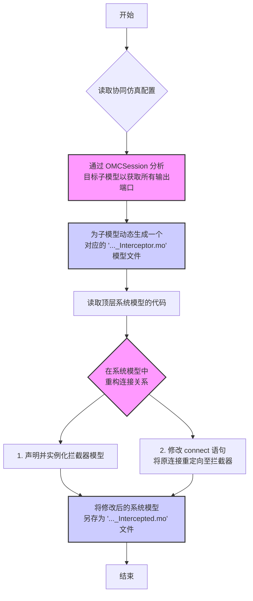
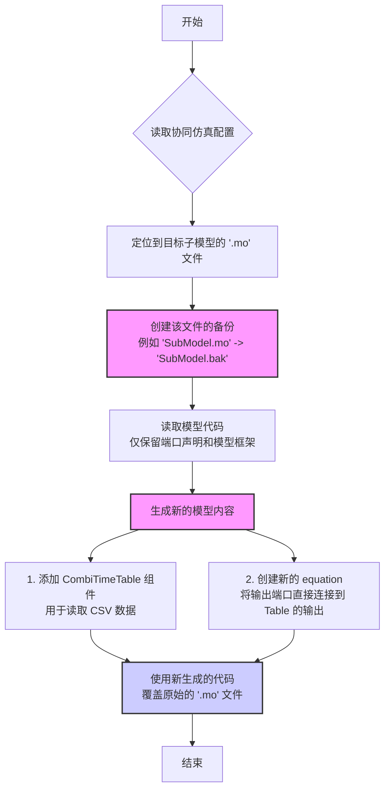

在协同仿真中，TRICYS 提供了两种将外部数据注入 Modelica 模型的方法。

## 1. 拦截器模式

### 1.1. 工作原理

拦截器模式是一种**非侵入式**的数据注入方法。它不会修改任何原始的模型文件，而是通过自动生成新模型的方式来实现。

其核心思想是在原始子模型和下游组件之间动态插入一个新建的“拦截器”模型。此拦截器像一个可配置的开关，它同时接收来自**原始子模型**的实时输出信号和来自 **CSV 文件**的预定义数据。通过在运行时设置模型参数，您可以精确控制每个输出信号是选择“直通”（Passthrough）上游的实时信号，还是“覆盖”（Override）为使用 CSV 文件中的数据。

这种模式的优势在于它的安全性和灵活性，所有修改都是在自动生成的副本上进行的（例如 `_Intercepted.mo`），原始模型和系统设计保持不变，非常适合用于“what-if”分析、故障注入或临时替换部分系统行为的场景。

### 1.2. 架构图

```
原系统结构：
  [上游模型] --> [子模型] --> [下游模型]

拦截器模式结构：
  [上游模型] --> [子模型] --> [拦截器] --> [下游模型]
                               ↑
                           [CSV 数据]
```

### 1.3. 实现步骤

`tricys` 会自动完成以下步骤来实现拦截器模式：



具体步骤分解如下：
1.  **分析模型**：`tricys` 首先使用 OpenModelica (OMC) 工具链分析目标子模型，自动识别出其所有的输出端口、维度等元信息。
2.  **生成拦截器**：根据上一步获取的端口信息，动态生成一个新的 Modelica 模型（`..._Interceptor.mo`）。该模型内部包含了 `CombiTimeTable` 组件（用于读取CSV）和数据选择逻辑。
3.  **修改系统**：`tricys` 读取顶层系统模型的代码，并执行以下修改：
    *   **实例化拦截器**：在 `equation` 部分之前添加对新生成的拦截器模型的实例声明。
    *   **重定向连接**：通过正则表达式自动查找并修改 `connect` 语句。原本从子模型输出端口到下游组件的连接被断开，转而通过拦截器进行路由：
        *   `子模型.输出端口` -> `拦截器.物理输入端口`
        *   `拦截器.最终输出端口` -> `下游组件.输入端口`
4.  **保存新系统**：将修改后的顶层系统模型内容保存为一个新的文件，并添加 `_Intercepted` 后缀，确保原始系统模型文件不受影响。

### 1.4. 拦截器模型示例

```modelica
within example_model;

model Plasma_Interceptor
  // 接收原模型输出
  Modelica.Blocks.Interfaces.RealInput physical_to_Pump[5];
  
  // 最终输出
  Modelica.Blocks.Interfaces.RealOutput final_to_Pump[5];
  
  protected
    parameter String fileName = "plasma_data.csv";
    
    // 列映射参数：[time, y1, y2, y3, y4, y5]
    // 如果某列设为 1，表示使用物理数据而非 CSV
    parameter Integer columns_to_Pump[6] = {1, 2, 3, 4, 5, 6};
    
    // CSV 读取器
    Modelica.Blocks.Sources.CombiTimeTable table_to_Pump(
      tableName="csv_data_to_Pump",
      fileName=fileName,
      columns=columns_to_Pump,
      tableOnFile=true
    );
  
  equation
    // 逐元素选择数据源
    for i in 1:5 loop
      final_to_Pump[i] = if columns_to_Pump[i+1] <> 1 
                         then table_to_Pump.y[i]   // 使用 CSV
                         else physical_to_Pump[i]; // 使用物理数据
    end for;

end Plasma_Interceptor;
```


---

## 2. 直接替换模式

### 2.1. 工作原理

直接替换模式是一种**侵入式**但高效的方法。它会直接修改目标子模型的文件，用一个“数据播放器”来完全替代其原有的内部逻辑。

工作流程是，`tricys` 首先会为目标子模型创建一个备份文件（`.bak`）。然后，它会“清空”原始模型文件中的所有内部方程和变量，仅保留其输入/输出端口的声明。接着，它向该模型中添加 `CombiTimeTable` 组件，并将输出端口直接连接到这些组件的数据输出上。

最终，该子模型变成了一个简单的数据源，其行为完全由外部 CSV 文件定义。这种模式适用于当你需要用一个固定的数据集（例如，来自高精度仿真的结果或实验数据）来永久或半永久地替换一个计算昂贵或暂不可用的子模型时。

### 2.2. 架构图

```
原系统结构：
  [上游模型] --> [子模型] --> [下游模型]

直接替换模式：
  [上游模型] --> [子模型(CSV版)] --> [下游模型]
                     ↑
                 [CSV 数据]
```

### 2.3. 实现步骤

`tricys` 通过以下自动化流程实现直接替换：



具体步骤分解如下：
1.  **定位与备份**：`tricys` 根据 `submodel_name` 在项目目录中找到对应的 `.mo` 文件，并立即创建一个 `.bak` 后缀的备份文件以防数据丢失。
2.  **解析与清空**：程序读取原始模型代码，并解析出其完整的输入/输出端口声明。然后，它会丢弃模型中所有其他内容，如 `parameter`, `protected` 部分的变量以及 `equation` 部分的所有方程。
3.  **生成新代码**：`tricys` 基于解析出的端口信息生成全新的模型代码：
    *   保留原始的端口声明，确保其对外接口不变。
    *   为每个需要被 CSV 数据驱动的输出端口，添加一个 `CombiTimeTable` 实例，并配置好 `fileName` 和 `columns` 等参数。
    *   创建一个新的 `equation` 部分，用简单的映射语句 `output_port = table.y` 将输出端口直接连接到 `CombiTimeTable` 的数据输出上。
4.  **覆盖文件**：最后，`tricys` 用新生成的代码完全覆盖原始的 `.mo` 文件，完成替换过程。由于子模型的接口（端口）没有改变，顶层系统模型无需任何修改。

### 2.4. 替换后模型示例

```modelica
within example_model;

model Plasma
  // 原有端口声明保持不变
  Modelica.Blocks.Interfaces.RealInput pulseInput;
  Modelica.Blocks.Interfaces.RealOutput from_Fueling_System[5];
  Modelica.Blocks.Interfaces.RealOutput to_FW[5];
  Modelica.Blocks.Interfaces.RealOutput to_Div[5];
  Modelica.Blocks.Interfaces.RealOutput to_Pump[5];

protected
  parameter String fileName = "plasma_data.csv";
  
  // CSV 数据源
  Modelica.Blocks.Sources.CombiTimeTable table_to_Pump(
    tableName="csv_data_to_Pump",
    fileName=fileName,
    columns={1, 2, 3, 4, 5, 6},  // time + 5 data columns
    tableOnFile=true
  );
  
  Modelica.Blocks.Sources.CombiTimeTable table_to_FW(
    tableName="csv_data_to_FW",
    fileName=fileName,
    columns={1, 7, 8, 9, 10, 11},
    tableOnFile=true
  );
  
  // ... 其他端口的 table 定义 ...

equation
  // 直接映射 CSV 到输出（忽略输入）
  for i in 1:5 loop
    to_Pump[i] = table_to_Pump.y[i];
    to_FW[i] = table_to_FW.y[i];
    to_Div[i] = table_to_Div.y[i];
    from_Fueling_System[i] = table_from_Fueling_System.y[i];
  end for;

end Plasma;
```


---


## 3. 编写您自己的处理器

除了使用内置的处理器，`tricys` 协同仿真框架最强大的功能是允许您编写自己的 Python 函数（处理器）来动态生成注入到 Modelica 模型中的数据。这意味着您可以集成任何复杂的外部模型、算法或数据源。

### 3.1. 处理器配置

在 `config.json` 的 `co_simulation.handlers` 列表中，每一个处理器对象都包含以下字段来定义其行为：

- **`handler_module` 或 `handler_script_path`** (字符串, 必填之一):
    - **`handler_module`**: 指定处理器函数所在的 **Python 模块** 的完整路径。适用于代码是标准 Python 包一部分的场景。
    - **`handler_script_path`**: 指定包含处理器函数的 **Python 脚本文件** 的路径。这更加灵活，适用于独立的脚本文件。

- **`handler_function`** (字符串, 必填):
    - **描述**: 要在指定模块或脚本中调用的函数名。

- **`params`** (字典, 选填):
    - **描述**: 一个包含要传递给处理器函数的任意关键字参数的字典。

### 3.2. 函数签名与职责

为了能被 `tricys` 框架正确调用，您的处理器函数**必须**遵循特定的签名。框架会自动通过**关键字参数**传入两个核心路径，您的函数需要定义并接收它们：

```python
def my_handler(temp_input_csv: str, temp_output_csv: str, **kwargs) -> dict:
    """
    一个标准的处理器函数签名。
    
    Args:
        temp_input_csv (str): 一个 CSV 文件的路径，包含上游模型的输出结果。
                              您可以读取此文件来获取驱动您计算的输入。
        temp_output_csv (str): 一个目标 CSV 文件的路径，您需要将计算结果写入此文件。
                               tricys 会将此文件提供给 Modelica 的 CombiTimeTable。
        **kwargs: 用于接收来自 JSON 配置中 "params" 的所有自定义参数。

    Returns:
        dict: 一个字典，用于配置 Modelica CombiTimeTable 的列映射。
    """
    # ... 您的代码逻辑 ...
```

**核心职责**:
1.  **读取输入 (可选)**: 使用 Pandas 或其他库读取 `temp_input_csv` 文件，获取上游模型的动态输出。
2.  **执行计算**: 运行您的模型、算法或任何其他逻辑。
3.  **写入输出**: 将您的计算结果（必须包含 `time` 列）保存为 CSV 格式到 `temp_output_csv` 指定的路径。

### 3.3. 返回值

处理器函数**必须**返回一个字典。这个字典的**键**对应 Modelica 子模型的**输出端口名**，**值**是一个字符串，用于配置 `CombiTimeTable` 的 `columns` 参数，定义了如何从您生成的 CSV 文件中读取数据列。

- **示例**: `return {"to_CL": "{1,2,3,4,5,6}"}`
  - 这告诉 `tricys`，对于名为 `to_CL` 的输出端口，生成的 `CombiTimeTable` 应该使用您在 `temp_output_csv` 中写入的第 1 到第 6 列数据（其中第 1 列通常是 `time`）。

### 3.4. 完整示例

以内置的 `div_handler.py` 为例，它模拟了一个简单的外部模型，该模型不依赖上游输入，而是自己生成数据。

**步骤 1: 创建处理器脚本**

```python
# tricys/handlers/div_handler.py

import os
import pandas as pd

def run_div_simulation(temp_input_csv, temp_output_csv, **kwargs):
    """
    一个简单的处理器，它读取一个预定义的 CSV 文件并将其内容
    写入到框架指定的目标输出路径。
    """
    # 获取当前文件所在目录，以定位数据文件
    handler_dir = os.path.dirname(__file__)
    source_csv_path = os.path.join(handler_dir, "div_handler.csv")

    # 读取源数据
    source_df = pd.read_csv(source_csv_path)

    # 定义需要输出到 Modelica 的列
    columns_to_select = [
        "time",
        "div.to_CL[1]", "div.to_CL[2]", "div.to_CL[3]",
        "div.to_CL[4]", "div.to_CL[5]",
    ]
    output_df = source_df[columns_to_select].copy()

    # 将处理后的数据写入框架指定的目标 CSV 文件
    output_df.to_csv(temp_output_csv, index=False)

    # 返回端口与列的映射关系
    output_placeholder = {"to_CL": "{1,2,3,4,5,6}"}
    return output_placeholder
```

**步骤 2: 在 `config.json` 中配置**

```json
"co_simulation": {
    "mode": "interceptor",
    "handlers": [
        {
            "submodel_name": "example_model.DIV",
            "instance_name": "div",
            "handler_module": "tricys.handlers.div_handler",
            "handler_function": "run_div_simulation",
            "params": {}
        }
    ]
}
```

在这个配置中，`tricys` 会:
1.  导入 `tricys.handlers.div_handler` 模块。
2.  调用 `run_div_simulation` 函数。
3.  函数执行后，生成一个新的 CSV 文件。
4.  使用函数返回的 `{"to_CL": "{1,2,3,4,5,6}"}` 来配置注入到 Modelica 仿真中的 `CombiTimeTable`。

---
