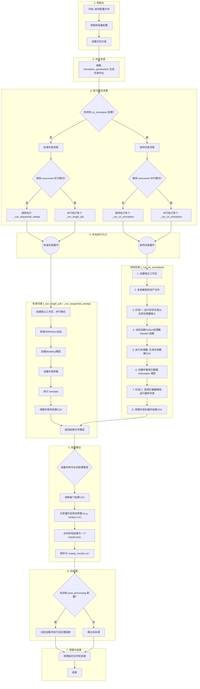

## 1. 仿真执行流程

`tricys` 的核心仿真流程由 `tricys/simulation/simulation.py` 脚本驱动。它被设计为一个高度可配置的、健壮的仿真业务流程协调程序，能够处理从简单的单次运行到复杂的多参数、多模式（标准/协同）仿真。

以下是完整的执行流程图和详细步骤解释。

## 2. 详细流程图

## 3. 流程步骤详解

### 3.1. 初始化
- **读取和准备配置**: 流程从一个JSON配置文件开始。`tricys`会读取此文件，解析所有路径、仿真设置和参数，并准备一个内部使用的配置对象。
- **设置日志记录**: 根据配置文件中的日志设置，初始化全局日志记录器，以便在整个流程中记录详细的步骤、警告和错误。

### 3.2. 作业生成
- `tricys`会检查配置中的 `simulation_parameters` 部分。如果定义了参数扫描（例如，一个参数有多个值），它会为每个参数组合生成一个独立的“作业”。如果未定义参数扫描，则只会生成一个默认作业。

### 3.3. 执行模式决策
这是流程的一个关键分支点，`tricys`会根据配置决定如何执行生成的作业：
- **标准仿真 vs 协同仿真**: 首先检查是否存在 `co_simulation` 配置块。如果存在，将进入[协同仿真流程](../co_simulation_module.md)；否则，进入标准仿真流程。
- **并行 vs 顺序**: 接着，检查 `simulation.concurrent` 标志。如果为 `true`，`tricys`会使用[并发模式](concurrency.md)（多线程或多进程）同时执行多个作业。如果为 `false`，则会按顺序逐个执行作业。

这四个组合（标准/顺序, 标准/并行, 协同/顺序, 协同/并行）分别对应不同的执行函数，以实现最佳性能和隔离性。

### 3.4. 作业执行
每个作业都在一个独立的、隔离的工作区中执行，以防止文件冲突。

- **标准仿真流程 (`_run_single_job` / `_run_sequential_sweep`)**:
  1. 获取一个 `OMPython` 会话。
  2. 加载指定的 Modelica 模型包。
  3. 将当前作业的参数应用到模型中。
  4.调用 `simulate()` 执行仿真。
  5. 对生成的 `_res.csv` 结果文件进行清理（例如，去除重复的时间点），并返回其路径。

- **协同仿真流程 (`_run_co_simulation`)**:
  这是一个更复杂的多阶段过程，用于将 Modelica 模型与外部 Python 逻辑（称为"Handler"）集成：
  1. **创建工作区**: 为作业创建一个完全隔离的临时目录。
  2. **复制资产**: 将模型文件（`.mo`）以及Handler可能需要的任何外部文件（如CSV、查找表等）复制到工作区。
  3. **阶段一：初步仿真**: 运行一次初步仿真。这次仿真的目的不是得到最终结果，而是为了生成Handler所需要的输入信号。例如，一个外部控制器需要知道当前系统的温度和压力，这次仿真就会把这些变量的时间序列导出到 `primary_inputs.csv`。
  4. **执行Handler**: `tricys`动态加载配置文件中指定的Python Handler函数。
  5. **生成外部数据**: 调用Handler函数，它会读取 `primary_inputs.csv`，执行其内部逻辑（例如，一个PID算法或一个机器学习模型），然后生成一份输出CSV文件（例如 `handler_outputs.csv`）。
  6. **集成拦截器**: `tricys`会生成一个新的Modelica模型（称为[拦截器模型](co_simulation.md)），该模型能够读取 `handler_outputs.csv` 的数据，并将其作为输入注入到主模型中，从而取代或"拦截"原始模型的某个部分。
  7. **阶段二：最终仿真**: 使用这个被修改和拦截过的新模型运行最终的、完整的仿真。
  8. **保存结果**: 清理最终的仿真结果并返回其路径。

### 3.5. 结果聚合
所有作业执行完毕后：
1. `tricys`收集每个成功作业的结果文件路径。
2. 它逐个读取这些CSV文件，并将它们合并成一个大的 Pandas DataFrame。
3. 为了区分来自不同作业的数据，它会将变量列重命名，附加产生该数据的参数。例如，如果一个作业的参数是 `{"freq": 10}`，那么原始的 `voltage` 列会变为 `voltage&freq=10`。
4. 最终，这个合并后的 DataFrame 被保存为 `sweep_results.csv`（用于参数扫描）或 `simulation_result.csv`（用于单次运行）。

### 3.6. 后处理
如果配置文件中定义了 `post_processing` 任务，`tricys`会在此时执行它们。它会动态加载指定的Python函数，并将上一步生成的合并结果DataFrame作为输入传递给它。这允许用户无缝地对接自定义的[分析、绘图或报告生成脚本](../../guides/tricys_basic/post_processing_module.md)。

### 3.7. 清理与结束
- 除非在配置中设置了 `keep_temp_files: true`，否则 `tricys` 会自动删除所有在执行过程中创建的临时工作区和文件。
- 流程结束。
