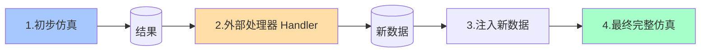

# 协同仿真模块

协同仿真（Co-Simulation）是 `tricys` 中一项高级且强大的功能，它允许 Modelica 模型与外部程序（如 Aspen Plus, MATLAB, 或自定义的 Python 脚本）进行交互，实现0维系统模型与3维子模块多物理场模型进行系统集成。

这对于以下场景尤其有用：

- 某个子系统的模型在另一个专业软件中已经存在且非常成熟。
- 子系统的行为非常复杂，难以用 Modelica 语言直接描述，但可以通过外部计算得到。

## 1. 工作流程

协同仿真的核心思想是“**运行-处理-再运行**” (Run-Process-Rerun)。



1.  **初步仿真 (Primary Run)**: `tricys` 首先运行一个不包含被替代子系统的初步仿真。
2.  **调用处理器 (Call Handlers)**: 初步仿真的结果被传递给一个或多个用户定义的“处理器”(Handler)。
3.  **外部计算**: 处理器函数接收结果，并调用外部程序（如 Aspen）或执行内部算法，计算出新的数据。
4.  **数据注入 (Injection)**: 处理器返回一个数据字典。`tricys` 会动态地创建一个新的顶层模型，用 `CombiTimeTable` (数据表) 模块替换掉原来的子系统，并将处理器返回的数据作为这个数据表的内容。
5.  **最终仿真 (Final Run)**: `tricys` 运行这个被动态修改过的、包含注入数据的新模型，从而完成一次完整的协同仿真。

## 2. 配置文件示例

通过在 `config.json` 中定义 `co_simulation` 字段来启用此功能。

```json
{
    "paths": { ... },
    "simulation": { ... },
    "simulation_parameters": { ... },
    "co_simulation": {
        "mode": "replacement",
        "handlers":[
            {
                "submodel_name": "example_model.I_ISS",
                "instance_name": "i_iss",
                "handler_module": "tricys.handlers.i_iss_handler",
                "handler_function": "run_dummy_simulation",
                "params": {
                    "description": "This is a dummy handler for i_iss.",
                    "dummy_value": 123.45
                }
            },
            {
                "submodel_name": "example_model.DIV",
                "instance_name": "div",
                "handler_module": "tricys.handlers.div_handler",
                "handler_function": "run_div_simulation",
                "params": {
                    "description": "This is a dummy handler for i_iss.",
                    "dummy_value": 123.45
                }
            }
        ]
    }
}
```

## 3. 配置项详解

### 3.1. `co_simulation` (顶层对象)

| 参数 (Parameter) | 类型与要求 | 描述 |
| :--- | :--- | :--- |
| `mode` | 字符串, 选填 | 定义协同仿真的集成模式。默认为 `"interceptor"`。 |
| `handlers` | 列表, 必填 | 一个或多个“处理器配置对象”的列表，每个对象定义如何处理一个特定的子模型。 |

### 3.2. `mode` (集成模式)

`mode` 字段决定了 `tricys` 如何将外部计算结果集成回 Modelica 模型中。

-   `"interceptor"` (默认模式):
    -   **非侵入式**。它会为目标子模型生成一个“拦截器”包裹模型，并在一个新的顶层系统模型中重定向连接。
    -   **优点**: 原始模型文件（包括子模型和顶层模型）都保持不变，安全性高。
    -   **适用场景**: 推荐在大多数情况下使用，尤其是当您不希望修改原始模型库时。

-   `"replacement"`:
    -   **侵入式**。它会直接修改目标子模型的 `.mo` 文件（会创建 `.bak` 备份），将其内部逻辑完全替换为从CSV文件读取数据的逻辑。
    -   **优点**: 实现更直接，不需要生成新的顶层模型。
    -   **适用场景**: 当您希望对子模型进行永久性或半永久性的行为替换，或者在某些复杂的模型结构中，“拦截器”模式难以实现连接重路由时。

### 3.3. `handlers` (配置对象列表)

`handlers` 列表中的每个对象都定义了一个具体的替换任务。

| 参数 (Parameter) | 类型与要求 | 描述 |
| :--- | :--- | :--- |
| `submodel_name` | 字符串, 必填 | 要被外部处理器替代的子模型的完整 Modelica 类路径。例如 `example_model.DIV`。 |
| `instance_name` | 字符串, 必填 | 该子模型在顶层仿真模型 (`simulation.model_name`) 中的**实例名**。例如，如果顶层模型中有 `DIV div;`，那么这里的 `instance_name` 就是 `div`。 |
| `handler_script_path` | 字符串, 推荐 | 指向包含处理器逻辑的 Python **脚本文件**的相对或绝对路径。这是指定处理器的首选方法。 |
| `handler_module` | 字符串, 兼容 | 包含处理器逻辑的 Python **模块**的路径（例如 `tricys.handlers.div_handler`）。用于向后兼容。如果同时提供了 `handler_script_path`，则优先使用脚本路径。 |
| `handler_function` | 字符串, 必填 | 在处理器脚本或模块中要调用的函数名。 |
| `params` | 字典, 选填 | 一个字典，其中包含的键值对将作为关键字参数传递给处理器函数。 |

## 4. 结果输出

协同仿真的最终输出与标准仿真类似，会根据任务数量在结果目录 (`results_dir`) 中生成一个合并的 CSV 文件：

-   **单次运行**: `simulation_result.csv`
-   **参数扫描**: `sweep_results.csv`

在这个文件中，被外部处理器替代的子模块的相关变量列，其数据将来源于您的处理器函数的计算结果，而不是原始 Modelica 模型的计算结果。


## 5. 自定义处理器

要真正发挥协同仿真的威力，您需要创建自己的处理器函数。

### 5.1. 处理器函数规范

您的处理器必须遵循以下规范：

1.  **函数签名**:
    ```python
    def my_handler(temp_input_csv: str, temp_output_csv: str, **params) -> dict:
        # ... 函数体 ...
    ```
    - `temp_input_csv`: `tricys` 传入的 **输入文件路径**。该 CSV 文件包含了第一阶段仿真记录的、子模块所需的所有输入端口数据。
    - `temp_output_csv`: 您需要将计算结果写入的 **输出文件路径**。
    - `**params`: 一个字典，包含了您在 `config.json` 中为该处理器配置的所有 `params`。

2.  **核心逻辑**:
    - 使用 `pandas` 或其他库读取 `temp_input_csv` 的数据。
    - 执行您的核心计算逻辑。
    - 将结果（**必须包含 'time' 列**）保存到 `temp_output_csv` 路径。

3.  **返回值 (重要)**:
    - 函数 **必须** 返回一个字典，该字典描述了如何将您输出的 CSV 文件中的数据列映射到 Modelica 子模块的输出端口。
    - **键 (key)**: Modelica 子模块的输出端口名 (字符串)。
    - **值 (value)**: 一个表示 Modelica 数组的字符串，格式为 `"{t, y1, y2, ...}"`。其中 `t` 是 `time` 列的索引（通常是1），`y1`, `y2`... 是对应端口各维度数据列的索引。

### 5.2. 处理器示例

假设我们要替换的 Modelica 子模块 `MySubModel` 有一个5维输出端口 `to_O_ISS`。

**`my_div_handler.py`:**
```python
import pandas as pd

def run_div_simulation(temp_input_csv: str, temp_output_csv: str, **params) -> dict:
    """
    一个简单的处理器示例。
    它读取输入，将所有输入值乘以一个来自配置的因子，然后写回。
    """
    # 打印从 config.json 传入的参数
    factor = params.get("factor", 1.0)
    print(f"Running DIV handler with factor: {factor}")

    # 1. 读取输入数据
    input_df = pd.read_csv(temp_input_csv)

    # 2. 执行计算 (示例：将所有输入乘以因子)
    # 假设输入端口名为 'div.from_plasma[1]' 到 '[5]'
    output_df = pd.DataFrame()
    output_df['time'] = input_df['time']
    for i in range(1, 6):
        input_col_name = f'div.from_plasma[{i}]'
        output_col_name = f'to_O_ISS_{i}' # 在CSV中自定义列名
        if input_col_name in input_df.columns:
            output_df[output_col_name] = input_df[input_col_name] * factor
        else:
            output_df[output_col_name] = 0 # 如果输入不存在，则输出0

    # 3. 将结果写入指定的输出CSV文件
    output_df.to_csv(temp_output_csv, index=False)

    # 4. 返回端口到CSV列的映射
    # CSV有6列: time, to_O_ISS_1, ..., to_O_ISS_5
    # Modelica端口 to_O_ISS 是5维的
    # 映射关系:
    # time -> column 1
    # to_O_ISS[1] -> column 2 (to_O_ISS_1)
    # to_O_ISS[2] -> column 3 (to_O_ISS_2)
    # ...
    # to_O_ISS[5] -> column 6 (to_O_ISS_5)
    return {
        "to_O_ISS": "{1,2,3,4,5,6}"
    }
```

### 5.3. 更新配置文件

现在，您可以更新 `config.json` 来使用这个新的本地处理器脚本。我们推荐使用 `handler_script_path`，因为它比 `handler_module` 更直接。

同时，我们也可以明确指定协同仿真的 `mode`。

```json
{
    ...
    "co_simulation": {
        "mode": "interceptor", // "interceptor" (默认) 或 "replacement"
        "handlers": [
            {
                "submodel_name": "example_model.DIV",
                "instance_name": "div",
                "handler_script_path": "path/to/my_div_handler.py", // 使用脚本路径
                "handler_function": "run_div_simulation",
                "params": {
                    "factor": 1.5 // 传递给函数的自定义参数
                }
            }
        ]
    }
}
```

## 6. 高级：原理解说

- **[协同仿真](../../explanation/co_simulation.md)**：协同仿真中两种将外部数据注入 Modelica 模型的方法。