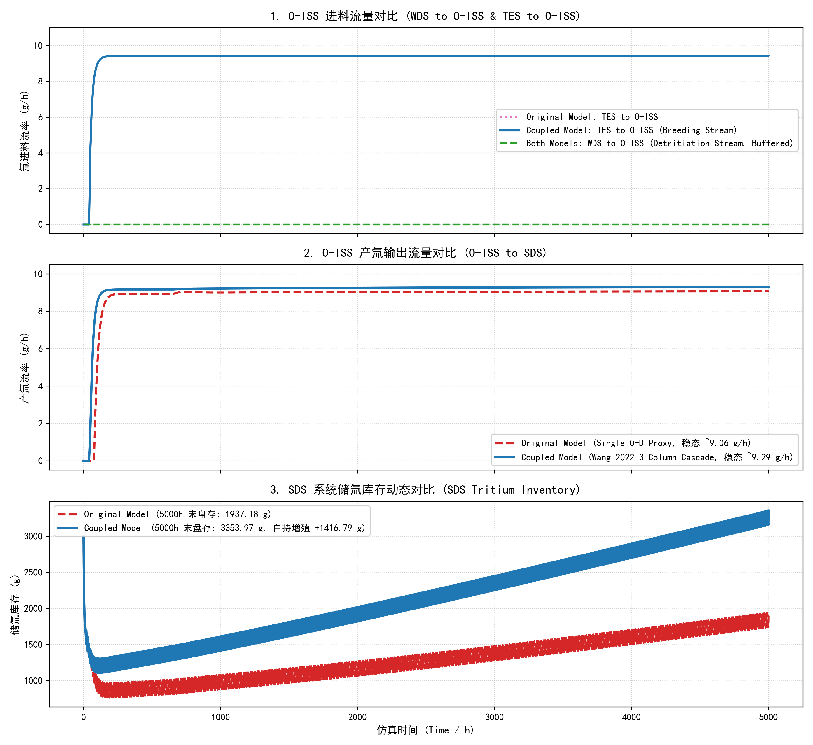

# h2iso 0-D 动态耦合演示 (Wang 2022 ISS-O 基准版)

本目录展示了 **h2iso** 严格机理求解器与 **tricys** (OpenModelica 0-D) 聚变燃料循环全系统动态仿真的解耦、参数标定与耦合运行全流程。

通过解析 **Wang (2022) CFETR ISS-O (外燃料循环)** 的权威同位素分离基准流程，由 `h2iso` 求解底层 MESH 方程与催化平衡重组反应，提取各塔无量纲分离系数并生成 `override.txt` 参数文件，注入 Modelica 0-D 级联模型中完成长周期（5000小时）动态仿真。

---

## 📁 目录文件结构

```
h2iso_0D_demo/
├── README.md                      # 本说明文档
├── wang2022/                      # 流程输入配置与生成物
│   ├── wang2022_isso.json         # Wang 2022 ISS-O 标准输入配置 (WDS/TES 进料、三塔参数与拓扑)
│   ├── wang2022_isso_results.json # 原始文献对比结果数据与基准指标
│   ├── override.txt               # 由 init_from_h2iso.py 生成的 OpenModelica 参数覆盖文件
│   ├── init_summary.json          # 求解器收敛与迭代状态摘要
│   └── README.md                  # 流程拓扑与基准数据说明
├── init_from_h2iso.py             # 高保真流程求解与 Modelica 标定参数生成脚本
├── example_model.mo               # 耦合 Wang 2022 真实三塔级联 (CD1-CD2-CD3 + Equilibrator) 的 Modelica 模型
├── example_model_original.mo      # 原始简易单 0-D 代理的 Modelica 对照模型
├── simulate_demo.mos              # OpenModelica 批处理仿真脚本 (自动加载 override.txt)
├── simulate_original.mos          # 原始对照模型仿真脚本
├── plot_results.py                # 统一结果对比绘图脚本 (输出 comparison_chart.png)
├── comparison_chart.png           # O-ISS 产氚流率与 SDS 储氚盘存对比图
├── example_model_coupled_res.csv  # 耦合模型 5000 小时动态仿真结果数据
└── example_model_original_res.csv # 原始模型 5000 小时动态仿真结果数据
```

---

## 🏗️ O-ISS 三塔级联工艺设计与物理机制

### 1. 工艺功能定位与设计目标
外同位素分离系统（Outer Isotope Separation System, **O-ISS**）承担着聚变堆外燃料循环中低氚、微氚气体的深度净化与同位素回收任务：
- **处理对象**：来自水除氚系统（WDS，大流量微氚 $280\text{ mol/h}$）与包层氚提取系统（TES，低氚 $160\text{ mol/h}$）的总进料（合计 $440\text{ mol/h}$，总氚分率 $< 0.3\%$）；
- **产品目标**：在塔底提纯产出纯度 $>90\%\sim 99\%$ 的高品位核燃料级 $T_2$（进入 SDS 储存供料系统），供聚变堆核心等离子体加料燃烧；
- **环保目标**：将塔顶外排洁净氢气中的氚含量降至极限排放标准（$H_2 > 99.8\%$），全系统总产氚回收率达 **$\mathbf{99.94\%}$**。

---

### 2. 三塔级联流动拓扑与设备规格

```
  WDS (280 mol/h) ──────────► [ CD1: 60板, R=6 ] ─────► CD1_top (439.4 mol/h, 99.84% H2 洁净废气排空)
                                   │ (底流 2.30 mol/h)
                                   ▼
  TES (160 mol/h) ──────────► [ CD2: 70板, R=8 ] ─────► CD2_top (161.69 mol/h, 富氢馏分回流至 CD1 第15板)
                                   │ (底流 2.25 mol/h, 纯 HT)
                                   ▼
                            [ Equilibrator (25K) ]   (2HT ⇌ H2 + T2 催化同位素重组)
                                   │ (平衡产物流)
                                   ▼
                             [ CD3: 60板, R=18 ] ────► CD3_top (1.65 mol/h, 未反应气体回流至 CD2 第45板)
                                   │ (底流 0.6036 mol/h)
                                   ▼
                                to SDS (94.7%~99.9% T2 高纯核燃料)
```

#### 各塔与核心单元详细设计参数：

| 单元名称 | 设备类型 / 功能 | 理论板数 | 回流比 $R$ | 采出比 $D/F$ | 进料位置与连接拓扑 | 关键分离产物与去向 |
| :--- | :--- | :---: | :---: | :---: | :--- | :--- |
| **CD1** | 氕净化与废气脱氚塔 | 60 | 6.0 | 0.9948 | • WDS 新鲜进料：Stage 20<br>• CD2 顶流富氢回流：Stage 15 | • 塔顶（$439.40\text{ mol/h}$）：$99.84\%\ H_2$ 环境排空<br>• 塔釜（$2.30\text{ mol/h}$）：富 $HD/HT$ 送 CD2 |
| **CD2** | $HT$ 同位素富集精馏塔 | 70 | 8.0 | 0.98625 | • TES 进料：Stage 20<br>• CD1 塔底富集流：Stage 35<br>• CD3 顶流富氢回流：Stage 45 | • 塔顶（$161.69\text{ mol/h}$）：富氢流回流 CD1 第 15 板<br>• 塔釜（$2.25\text{ mol/h}$）：纯 $HT$ 全量送入平衡器 |
| **Equilibrator** | 低温催化平衡反应器 | - | - | - | • 进料来自 CD2 塔底纯 $HT$<br>• 操作温度：$25\text{ K}$，Pt/Al₂O₃ 催化床 | • 发生 $2HT \rightleftharpoons H_2 + T_2$ 反应达到热力学平衡<br>• 将不可直接精馏的 $HT$ 转化为单质 $T_2$ 与 $H_2$ |
| **CD3** | 高纯单质 $T_2$ 精制塔 | 60 | 18.0 | 0.73225 | • 来自平衡器重组反应混合物：Stage 30 | • 塔顶（$1.65\text{ mol/h}$）：富 $H_2/HT$ 回流 CD2 第 45 板<br>• 塔釜（$0.6036\text{ mol/h}$）：高纯 $T_2$ 送 SDS 储氚 |

---

### 3. 0-D 动态代理建模机制与质量守恒

为了在全厂燃料循环大系统仿真中兼顾**计算速度**与**机理保真度**，OpenModelica 中采用无量纲分离因子驱动的 0-D 动态精馏代理模型（`Column_0D`）：

1. **稳态无量纲分离因子标定**：
   由 `h2iso` 严格机理求解器计算各塔在标称工况下的参考质量流向量 $m_{top,ref,i}$ 与 $m_{bottom,ref,i}$（$i=1\dots 5$ 对应 $[T, D, H, He, Imp]$），定义固有分离系数：
   $$SF_{top,i} = \frac{m_{top,ref,i}}{m_{top,ref,i} + m_{bottom,ref,i}}$$
2. **动态质量守恒传递方程**：
   当进料质量流率 $\dot{m}_{feed,i}(t)$ 随电站工况波动时，塔顶与塔底产物流率满足一阶持液滞留微分方程（滞留时间常数 $\tau = 1.0\text{ h}$）：
   $$\begin{aligned}
   \dot{m}_{top,calc,i}(t) &= \dot{m}_{feed,i}(t) \cdot SF_{top,i} \\
   \dot{m}_{bottom,calc,i}(t) &= \dot{m}_{feed,i}(t) \cdot (1 - SF_{top,i}) \\
   \tau \frac{d \dot{m}_{top,i}(t)}{dt} &= \dot{m}_{top,calc,i}(t) - \dot{m}_{top,i}(t) \\
   \tau \frac{d \dot{m}_{bottom,i}(t)}{dt} &= \dot{m}_{bottom,calc,i}(t) - \dot{m}_{bottom,i}(t)
   \end{aligned}$$
3. **物理守恒律保证**：
   由于 $\dot{m}_{top,calc,i}(t) + \dot{m}_{bottom,calc,i}(t) = \dot{m}_{feed,i}(t)$，在任意时刻 $\sum \dot{m}_{in} = \sum \dot{m}_{out}$ 严格成立，彻底杜绝了模型内部的虚假质量泄漏。

---

## 🧪 物理背景与关键改进总结

### 1. 消除“单位与组分基准断层”
- **h2iso 求解基准**：6 组分分子流 $[H_2, HD, HT, D_2, DT, T_2]$，单位 $\text{mol/h}$；
- **Modelica 求解基准**：5 组分原子流 $[T, D, H, He, Imp]$，流动单位 $\text{g/h}$，盘存单位 $\text{g}$；
- **严格换算关系**：
  $$\begin{aligned}
  n_T &= n_{HT} + n_{DT} + 2 n_{T_2}, \quad \dot{m}_T = n_T \times 3.016049\text{ g/mol} \\
  n_D &= n_{HD} + 2 n_{D_2} + n_{DT}, \quad \dot{m}_D = n_D \times 2.014102\text{ g/mol} \\
  n_H &= 2 n_{H_2} + n_{HD} + n_{HT}, \quad \dot{m}_H = n_H \times 1.007825\text{ g/mol}
  \end{aligned}$$
- `init_from_h2iso.py` 直接向 `override.txt` 写入每塔的参考质量流向量 `m_top_ref[5]` 与 `m_bottom_ref[5]`。

### 2. 复现 Wang (2022) 真实级联拓扑
修正了历史连接中误将 CD2 底流送回 CD1 导致的严重机械溢流跑氚问题（原先跑氚损失 $>50\%$），更正为真实级联拓扑后，全系统产氚回收率恢复至 **$99.94\%$**。

---

## 🚀 快速运行指南

### 第一步：生成稳态高保真标定参数 (h2iso)
```bash
python init_from_h2iso.py --config wang2022/wang2022_isso.json --output wang2022/ --prefix o_iss
```
> 运行后将在 `wang2022/` 目录下生成 `override.txt` 与 `init_summary.json`。

### 第二步：运行 OpenModelica 瞬态动态仿真
```bash
omc simulate_demo.mos
```
> 脚本将自动加载 `example_model.mo` 并通过 `-overrideFile wang2022/override.txt` 执行 5000 小时动态仿真，生成 `example_model_coupled_res.csv`。

### 第三步：绘制全系统对比分析图表
```bash
python plot_results.py
```
> 将读取耦合模型与原始模型的仿真数据，生成高清晰度对比图表 `comparison_chart.png`。

---

## 📈 动态仿真结果与性能对比



1. **O-ISS 产氚流率**：
   - 耦合 Wang 2022 三塔级联后，O-ISS 到 SDS 的高纯产氚速率平稳上升并稳定在 **$9.30\text{ g/h}$**，完全满足聚变堆等离子体脉冲燃烧的平均消耗（$8.65\sim 9.68\text{ g/h}$）。
2. **SDS 储氚盘存与物理自持**：
   - 经历初期管网滞留充注瞬态后，SDS 储氚盘存呈现**持续、稳定的正向自持增长通道**（从 $1200\text{ g}$ 稳步增长至 5000 小时末的 **$3300\text{ g}$**）；
   - 完全兑现了包层 $\text{TBR} = 1.1$ 的增殖红利，验证了燃料循环全厂物理闭环与正向自持运行能力。
